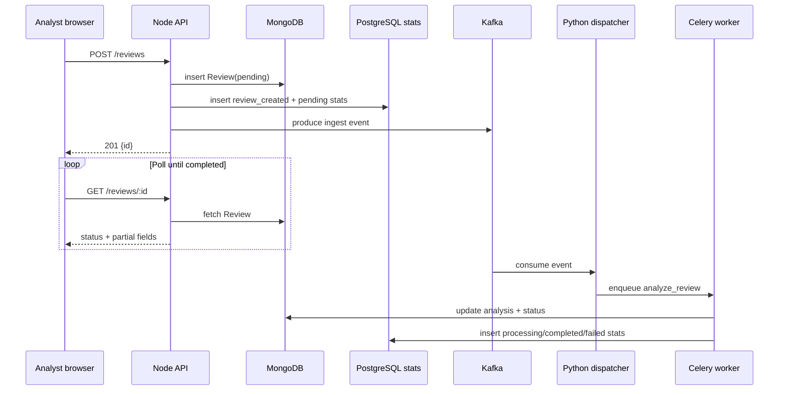
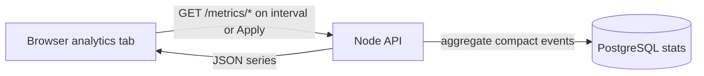
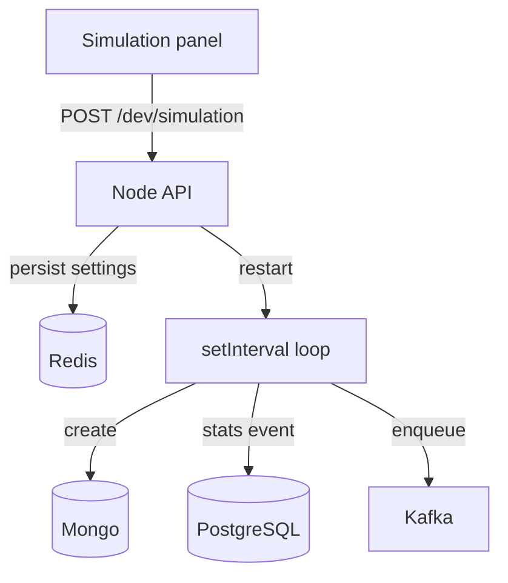
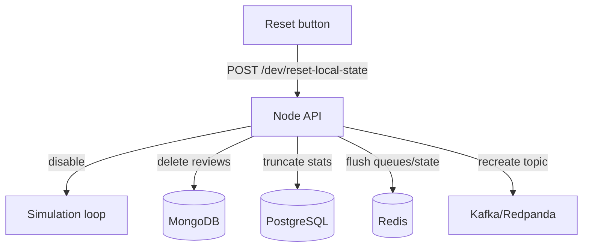
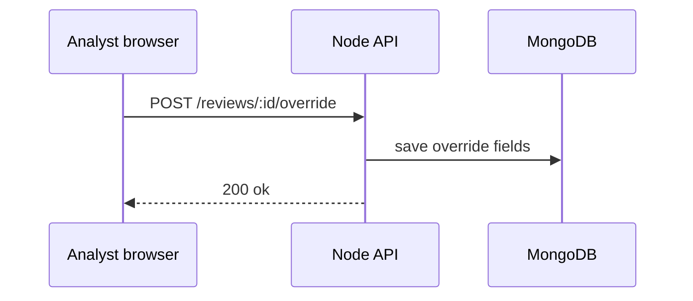
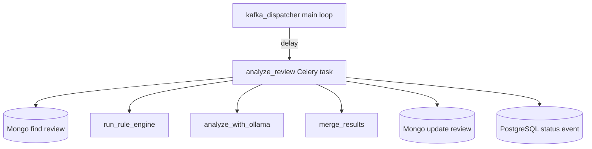

# System handbook (comprehensive)

This document is intentionally long. It is meant to answer “what is this software, why does it exist, how is it structured, and how do requests move through it?” in one place. If you want a shorter non-technical explanation, read `USER_GUIDE_BUSINESS.md` first.

## Plain-language purpose

Suspicious Email Triage is a **workbench** for security analysts. It accepts email-like content, stores it as a structured record, runs automated checks asynchronously, and presents an explainable result that humans can accept, reject, or annotate.

The product value is not only automation; it is also **traceability**: overrides and timestamps create an audit story that a client company can use internally after an incident.

## The technologies in play (and why they appear)

### React (frontend)

**Role:** user interface for submission, polling, dashboards, charts, and dev-only simulation controls.

**Why React:** mature ecosystem, component model, and straightforward deployment as static assets behind any CDN or reverse proxy.

### Node.js + Express (backend)

**Role:** HTTP API boundary, validation, persistence orchestration, Kafka produce, PostgreSQL-backed metrics, centralized JSON logging, and the dev simulation loop.

**Why Node here:** matches many teams’ service stacks, integrates cleanly with MongoDB via Mongoose, and keeps ingestion logic co-located with the API that receives browser traffic.

### Kafka / Redpanda (event bus)

**Role:** durable “something happened” notifications that decouple ingestion from scoring.

**Why Kafka:** replayability, fan-out, and a clear boundary between “write to DB” and “do expensive work.” Local development uses Redpanda to reduce operational overhead while keeping the client API compatible.

### Celery + Redis (async workers)

**Role:** Python executes the scoring pipeline as background tasks; Redis is the broker/result backend.

**Why Celery:** standard Python task model, easy horizontal scaling of workers, and isolation from the Node process so heavy libraries do not destabilize the API.

### MongoDB (documents)

**Role:** canonical store for review requests, current processing state, analysis output, and overrides.

**Why MongoDB:** flexible schema for evolving “analysisResult” structures during experimentation. It is not used as the chart statistics engine, because scanning large review documents for every graph can become wasteful over time.

### PostgreSQL (chart statistics)

**Role:** narrow event store for graph data such as “review created” and “status changed.”

**Why PostgreSQL:** charts usually need compact time-window aggregations. A relational table with timestamps and indexes is a better fit than repeatedly aggregating over full MongoDB review documents.

## Functional modes and use-cases

### UC1 — Analyst triage (primary)

An analyst submits a suspicious email and waits for results.

### UC2 — Manager visibility (analytics)

A manager reviews throughput and backlog health using charts.

When **Auto-refresh** is enabled in the analytics tab, the browser polls `GET /metrics/timeseries` and `GET /metrics/status-breakdown` every 30 seconds for the rolling last 24 hours. Manual mode uses the selected From/To window instead.

### UC3 — Engineering validation (dev simulation)

An engineer generates synthetic traffic at a controlled cadence to validate queues and dashboards without manual clicking.

### UC3b — Engineering cleanup (dev reset)

During demos and local development, engineers can reset local state so database and queue sizes do not grow forever.

### UC4 — Audit / dispute handling (override)

An analyst records a human decision with a reason string.

## Structure by technology (folders)

### Node.js (`backend/`)

- `src/server.js` — bootstraps Mongo + HTTP listener; hydrates simulation loop after listen.
- `src/http/createApp.js` — Express wiring: middleware, routes, health checks.
- `src/api/reviews.js` — CRUD-ish review endpoints and override endpoint.
- `src/api/metrics.js` — reporting endpoints backed by PostgreSQL statistics events.
- `src/stats/statsPg.js` — PostgreSQL schema setup, writes, chart queries, and dev reset truncation.
- `src/kafka/reviewIngestProducer.js` — KafkaJS producer for ingest events.
- `src/services/reviewPipeline.js` — shared enqueue logic (Kafka + optional BullMQ).
- `src/dev/*` — dev-only simulation routes and timer loop.
- `src/worker/*` — optional BullMQ worker implementation (legacy/alternate path).

### React (`frontend/`)

- `src/TriageApp.jsx` — navigation shell between triage and analytics.
- `src/views/AnalyticsView.jsx` — charts, time controls, and auto-refresh toggle (rolling 24-hour PostgreSQL stats).
- `src/views/SimulationPanel.jsx` — dev simulation controls and local reset button.
- `src/hooks/useReviewPoller.js` — polling helper for async completion.

### Python (`ai_service/`)

- `kafka_dispatcher.py` — consumes Kafka messages and dispatches Celery tasks.
- `app/celery_app.py` — Celery configuration object.
- `app/tasks.py` — `analyze_review` task entrypoint.
- `app/rule_engine.py`, `app/llm_ollama.py`, `app/merge.py` — scoring pipeline pieces.
- `app/stats.py` — PostgreSQL status-event writer for charts.

## Control-flow (function-level) for scoring (Python path)

## Logging and observability (conceptual)

The API and Python services write JSON lines into a merged log file path (configurable). This supports keyword/topic filtering via `GET /logs/search` on the Node side.

## Where this document ends

This handbook is not a substitute for reading code when you are debugging a defect. Treat it as a map: it tells you what the terrain is supposed to look like, but the ground truth is always the repository.
