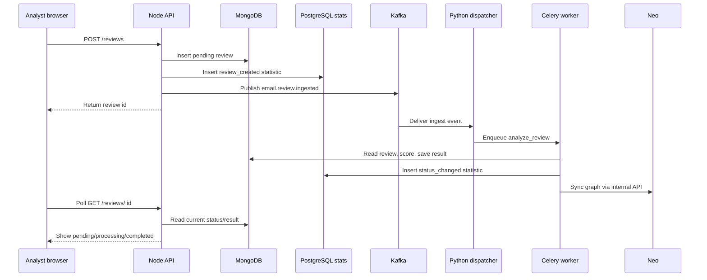

# Architecture, in practical language

This system is built as a small group of cooperating services. The browser gives analysts a comfortable workspace. The Node.js API accepts submissions quickly. Kafka carries “new review” events. Python/Celery workers do the slower scoring work. MongoDB stores the original review and the final result, while PostgreSQL stores narrow statistics events for charts.

The split is intentionally calm and flexible: if scoring is slow, the website can still accept a submission and show a “pending” or “processing” state while the background services catch up.

## Current main flow

```text
React browser
  -> Node.js / Express API
  -> MongoDB (save Review with status=pending)
  -> PostgreSQL (save narrow statistics event for charts)
  -> Kafka / Redpanda (publish email.review.ingested)
  -> Python dispatcher
  -> Celery worker
  -> MongoDB (save analysisResult and status=completed)
  -> PostgreSQL (save status statistics event)
  -> React browser polls for the latest result
```

## Components

### React frontend (`frontend/`)

The frontend is what users see. It offers a triage form, live status updates, recent review browsing, analytics graphs, a **Neo4j phishing relationship graph** view, and a dev-only simulation panel.

### Node.js API (`backend/src/`)

The Node API is the main browser-facing backend. It receives review submissions, stores them, publishes Kafka ingest events, exposes polling endpoints, and provides metrics for charts.

Metrics are read from PostgreSQL rather than MongoDB. This avoids repeatedly scanning large review documents just to draw graphs.

**Neo4j** stores sender, review, URL, domain, and campaign relationships for phishing graph analysis (see [graph_guide_neo4j_phishing.md](graph_guide_neo4j_phishing.md)).

### Python AI service (`ai_service/`)

The Python service handles asynchronous scoring. It consumes Kafka messages, schedules Celery tasks, reads MongoDB review documents, writes completed analysis results, and adds compact PostgreSQL status events for charts.

### Django tree (`backend/config`, `backend/core`, `backend/health`)

The repository also contains a Django project tree. It can support Django settings, management commands, health checks, and Python integration work. The current React UI primarily talks to the Node API, so Django is best understood as a coexisting service area rather than the main UI API.

## Local dev vs staging/prod data

- **dev** uses local services: MongoDB, PostgreSQL, Redis, and Redpanda/Kafka from Docker Compose.
- **staging** uses remote managed MongoDB, PostgreSQL, Redis, and Kafka-compatible services with staging credentials.
- **prod** uses remote managed MongoDB, PostgreSQL, Redis, and Kafka-compatible services with production credentials.

This keeps developer machines safe and repeatable while still allowing staging and production to behave like real deployments.

## Sequence diagram



## Operational notes

The architecture is intentionally modular. A team can scale the API, dispatcher, and Celery workers separately. Logs are written as JSON lines so they can be searched locally and later shipped to a log platform. In dev, the UI also offers a reset control that stops simulation, clears Mongo review data, truncates PostgreSQL statistics, flushes Redis queues, and recreates the local Kafka ingest topic.
---

## Command you can run (this guide) {#run-one-command}

<div style="background:#eef1f5;padding:1rem 1.25rem;border-left:4px solid #64748b;margin:1rem 0;border-radius:4px;">

<p><strong>Run in terminal</strong> — WSL, repository root unless noted</p>

```bash
cd ~/suspicious-email-triage
DEPLOYMENT_ENV=dev docker compose -f infra/docker/docker-compose.yml up -d backend mongo postgres redis ai-celery ai-kafka-dispatch
```

</div>

