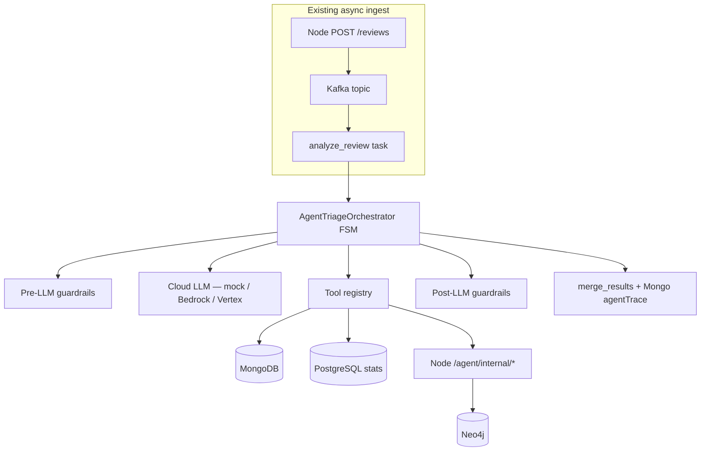

# Agent-assisted email triage — orchestration, tools, workflows, guardrails

This guide explains the **Agent Triage** backend enhancement: a bounded **finite-state machine (FSM)** that replaces the single-shot LLM call when `AGENT_TRIAGE_ENABLED=true`. It demonstrates four foundational LLM-application pillars — **orchestration**, **tools/actions**, **workflows**, and **guardrails** — using **Amazon Bedrock** or **Google Vertex AI** in staging/production, and a **free mock** (`mock-cloud-llm`) in local Docker.

No prior experience with AI agents, Bedrock, or Vertex is required.

**Related:** [data_guide_mock_llm.md](data_guide_mock_llm.md) (legacy single-shot LLM path), [arch_guide_worker_pipeline.md](arch_guide_worker_pipeline.md) (Kafka → Celery), [ops_guide_secrets_management.md](ops_guide_secrets_management.md) (tokens in gitignored secrets only).

---

## What problem does this solve?

A production SOC triage system cannot rely on one LLM prompt per email. Real investigations are **multi-step**:

1. Run cheap deterministic rules first.
2. Fetch graph context (campaign links).
3. Check whether the sender is a repeat offender.
4. Synthesize a structured verdict.
5. Enforce safety policies (PII masking, no verdict downgrades).

**Agent Triage** implements that pipeline as an **auditable FSM** inside the existing Celery worker — without replacing analyst override or the rule engine’s authority.

---

## Architecture (how it fits today’s stack)



| Layer | Technology | Meaning |
|-------|------------|---------|
| **Worker** | Celery (`ai_service/app/tasks.py`) | Same `analyze_review` task; agent path is env-gated |
| **Orchestration** | Python FSM (`app/agent/orchestrator.py`) | Explicit states — not an unbounded ReAct loop |
| **Cloud LLM** | `mock-cloud-llm`, Bedrock Converse, Vertex Gemini | PLAN + SYNTHESIZE JSON stages |
| **Tools** | `app/agent/tools.py` + Node `agentInternal.js` | Allowlisted DB queries and HTTP reads |
| **Workflow** | `workflow_policy.yaml` + `workflow.py` | Conditional branches after tool results |
| **Guardrails** | `app/guardrails/*` | PII mask, injection filter, schema validation, verdict floors |

---

## Pillar 1 — Orchestration (FSM)

### Pattern: finite-state machine

An **FSM** is a graph of named states with fixed transitions. Unlike a free-form “agent” that can loop forever, our FSM has a **maximum tool count** and **wall-clock budget** — important for cost control in production.

### States

| State | What happens |
|-------|----------------|
| `INTAKE` | Pre-LLM guardrails sanitize the review |
| `PLAN` | Cloud LLM returns JSON `subTasks[]` (investigation plan) |
| `TOOL_LOOP` | Workflow policy + allowlist execute ≤ 3 tools |
| `SYNTHESIZE` | Cloud LLM returns structured verdict JSON |
| `GUARD_VALIDATE` | Post-LLM guardrails + JSON Schema |
| `PERSIST` | Output merged via `merge_results`; `agentTrace` saved |
| `FALLBACK_RULES` | On hard failure → rule-only stub (`_agentFallback`) |

### Code entrypoint

```python
# ai_service/app/agent/orchestrator.py
run_agent_triage(review) -> AgentTriageResult
```

### Enable in dev

```bash
# backend/.env.dev — default false for deterministic CI
AGENT_TRIAGE_ENABLED=true
LLM_CLOUD_PROVIDER=mock
MOCK_CLOUD_LLM_URL=http://mock-cloud-llm:8091
```

Recreate Celery after changing env:

```bash
DEPLOYMENT_ENV=dev docker compose -f infra/docker/docker-compose.yml up -d --force-recreate ai-celery mock-cloud-llm backend
```

---

## Pillar 2 — Tools / actions

### Pattern: tool allowlist + JSON Schema

The LLM (or workflow policy) may only call tools defined in `TOOL_SPECS` (`app/agent/tools.py`). The orchestrator **executes** tools — the model never runs arbitrary code.

| Tool name | Type | Purpose |
|-----------|------|---------|
| `run_rule_engine` | Local Python | Deterministic phishing heuristics |
| `get_review_by_id` | Mongo query | Fresh review snapshot |
| `query_review_stats` | PostgreSQL | Recent `review_stats_events` rows |
| `get_graph_neighborhood` | HTTP → Node | Neo4j subgraph for campaigns |
| `lookup_sender_history` | HTTP → Node | Repeat-sender detection |

### Internal HTTP security

Celery calls Node routes under `/agent/internal/*` with header:

```
X-Agent-Internal-Token: <AGENT_INTERNAL_SERVICE_TOKEN>
```

Token lives in gitignored `backend/dev.secrets` (see `dev.secrets.example`). **Never paste the token into documentation.**

Routes are mounted **before** JWT middleware in `createApp.js` — same pattern as `/graph/internal/sync`.

---

## Pillar 3 — Workflows

### Pattern: YAML policy + Python interpreter

`workflow_policy.yaml` lists conditional steps. `workflow.py` evaluates them using a **safe whitelist** of condition keys (no `eval()` on arbitrary expressions).

Example branches:

- Always run `run_rule_engine`.
- If rule verdict is `suspicious` or `likely_phishing` → suggest `get_graph_neighborhood`.
- If sender has ≥ 2 recent reviews → suggest `query_review_stats`.
- If synthesis confidence ≥ 0.85 and verdict is `likely_phishing` → force `report_and_block`.

Structured synthesis schema (enforced in `post_llm.py` via **jsonschema**):

- `verdict`, `recommendedAction`, `summary`, `findings`, `confidence` (required)

---

## Pillar 4 — Guardrails

### Pre-LLM (`guardrails/pre_llm.py`)

| Rule | Behavior |
|------|----------|
| Prompt injection filter | Hard-fail → `FALLBACK_RULES` |
| PII masking (`pii.py`) | Emails/phones/PAN-like digits → `[*_REDACTED]` |
| Body size cap | Truncate at `AGENT_MAX_BODY_CHARS` |
| Token budget | Hard-fail if estimated input > `AGENT_MAX_INPUT_TOKENS` |

### Post-LLM (`guardrails/post_llm.py`)

| Rule | Behavior |
|------|----------|
| JSON Schema | Reject invalid synthesis (strict mode) |
| Verdict floor | Cannot output below `rule_engine` severity |
| Action consistency | `benign` → `close`, etc. |
| Content safety | Strip findings with JWT-like strings |
| Low confidence | Force `investigate` when confidence < `AGENT_MIN_CONFIDENCE` |

`GUARDRAIL_CLOUD_PROVIDER=local` uses only in-process rules in dev (no paid Comprehend API).

---

## Cloud providers (staging / production)

### Amazon Bedrock

```bash
LLM_CLOUD_PROVIDER=bedrock
AWS_REGION=us-east-1
BEDROCK_MODEL_ID=anthropic.claude-3-haiku-20240307-v1:0
```

Implementation: `app/agent/providers/bedrock_client.py` uses **boto3** `bedrock-runtime` **Converse** API.

IAM: grant Celery worker role `bedrock:InvokeModel` on the model ARN.

### Google Vertex AI

```bash
LLM_CLOUD_PROVIDER=vertex
GCP_PROJECT_ID=<your-gcp-project>
GCP_LOCATION=us-central1
VERTEX_MODEL_ID=gemini-1.5-flash-001
```

Implementation: `app/agent/providers/vertex_client.py` (requires `google-cloud-aiplatform` in prod images).

### Dev mock (zero cost)

```bash
LLM_CLOUD_PROVIDER=mock
MOCK_CLOUD_LLM_URL=http://mock-cloud-llm:8091
```

Container: `mock-cloud-llm` serves `POST /v1/converse` with stages `plan`, `tool_loop`, `synthesize`.

---

## MongoDB audit field: `agentTrace`

When agent mode runs, each completed review may include:

```json
{
  "agentTrace": {
    "runId": "uuid",
    "provider": "mock",
    "modelId": "mock",
    "statesVisited": ["INTAKE", "PLAN", "TOOL_LOOP", "SYNTHESIZE", "GUARD_VALIDATE", "PERSIST"],
    "toolCalls": [{ "name": "run_rule_engine", "ok": true, "latencyMs": 2 }],
    "guardrailEvents": [{ "stage": "pre", "rule": "pii_mask", "action": "redacted" }],
    "wallDurationMs": 120
  }
}
```

Use Compass to inspect — never copy live email bodies into tickets.

---

## Safety limits (laptop dev and staging/production) {#safety-limits}

Agent triage is designed so a misconfiguration **cannot** melt your laptop CPU, exhaust Mongo, or silently run up a cloud LLM bill.

### Default-off master switch

`AGENT_TRIAGE_ENABLED` defaults to **`false`**. CI, fresh clones, and most dev laptops therefore keep the legacy single-shot or mock LLM path. You must **explicitly** set `true` and recreate `ai-celery` to activate the FSM.

### Bounded FSM (not unbounded ReAct)

| Cap | Env variable | Default | What it prevents |
|-----|--------------|---------|------------------|
| Tool steps | `AGENT_MAX_TOOL_STEPS` | `3` | Infinite tool loops |
| Wall clock | `AGENT_MAX_WALL_MS` | `30000` (30 s) | Hung HTTP/LLM calls blocking a Celery worker |
| Body size | `AGENT_MAX_BODY_CHARS` | `8000` | Oversized prompts to paid APIs |
| Input tokens | `AGENT_MAX_INPUT_TOKENS` | `6000` | Token budget blowout (pre-LLM hard-fail) |
| Output tokens | `AGENT_MAX_OUTPUT_TOKENS` | `1024` | Long generations |

**Implementation:** `ai_service/app/agent/safety.py` reads caps; `orchestrator.py` calls `wall_budget_exceeded()` between FSM phases and routes to `FALLBACK_RULES` instead of continuing.

**Pattern:** *fail-safe degradation* — when a cap trips, analysts still get rule-engine output; Mongo stores the partial `agentTrace` for audit.

### Dev laptop: zero cloud cost

With `LLM_CLOUD_PROVIDER=mock`, all PLAN/SYNTHESIZE calls hit the local **`mock-cloud-llm`** container (port 8091). No AWS or GCP credentials are required. Docker Compose memory for the mock is small (single FastAPI process).

### Staging/production servers

| Concern | Mitigation |
|---------|------------|
| Bedrock/Vertex spend | Same tool/wall caps; monitor `agentTrace.wallDurationMs` via `GET /metrics/agent-triage` |
| Worker starvation | One FSM per `analyze_review` task — same Celery concurrency model as today |
| Internal API abuse | `/agent/internal/*` requires `X-Agent-Internal-Token` from gitignored secrets |
| Data exfiltration | Tool allowlist only — no arbitrary shell or SQL |

**UI visibility:** [ui_guide_agent_activity.md](ui_guide_agent_activity.md) documents the `#agent` fleet view and per-review `AgentTracePanel`.

---

## Environment variables (committed metadata only)

Set in `backend/.env.dev` (safe in Git):

| Variable | Default (dev) | Meaning |
|----------|---------------|---------|
| `AGENT_TRIAGE_ENABLED` | `false` | Master switch |
| `LLM_CLOUD_PROVIDER` | `mock` | `mock`, `bedrock`, or `vertex` |
| `MOCK_CLOUD_LLM_URL` | `http://mock-cloud-llm:8091` | Dev mock base URL |
| `AGENT_MAX_TOOL_STEPS` | `3` | Tool loop cap |
| `AGENT_MAX_WALL_MS` | `30000` | FSM wall-clock budget (ms) |
| `AGENT_PII_MASK_ENABLED` | `true` | Pre-LLM redaction |

Secrets in `backend/dev.secrets` (gitignored):

| Variable | Purpose |
|----------|---------|
| `AGENT_INTERNAL_SERVICE_TOKEN` | Celery → Node `/agent/internal` auth |

---

## Tests

```bash
cd ~/suspicious-email-triage/ai_service
pytest tests/test_agent_orchestrator.py tests/test_agent_safety.py tests/test_guardrails.py tests/test_workflow.py tests/test_agent_tools.py tests/test_mock_cloud_llm.py -q

cd ~/suspicious-email-triage/backend
npm test -- --watchAll=false --testPathPattern="agentInternal|agentTriageMetrics"
```

---

## Troubleshooting

| Symptom | Likely cause | Fix |
|---------|--------------|-----|
| Agent never runs | `AGENT_TRIAGE_ENABLED=false` | Set `true`, recreate `ai-celery` |
| Tool HTTP 401 | Token mismatch | Align `AGENT_INTERNAL_SERVICE_TOKEN` in dev.secrets |
| `FALLBACK_RULES` in trace | Injection, schema fail, or LLM error | Check `guardrailEvents` and worker logs |
| Still single-shot LLM | Agent disabled | Confirm env inside container: `docker compose exec ai-celery printenv AGENT_TRIAGE_ENABLED` |

---

## Command you can run (this guide) {#run-one-command}

<div style="background:#eef1f5;padding:1rem 1.25rem;border-left:4px solid #64748b;margin:1rem 0;border-radius:4px;">

<p><strong>Run in terminal</strong> — enable agent triage with mock cloud LLM</p>

```bash
cd ~/suspicious-email-triage
# Add AGENT_TRIAGE_ENABLED=true to backend/.env.dev (or export before compose)
DEPLOYMENT_ENV=dev docker compose -f infra/docker/docker-compose.yml up -d mock-cloud-llm ai-celery backend
cd ai_service && pytest tests/test_agent_orchestrator.py -q
```

</div>
