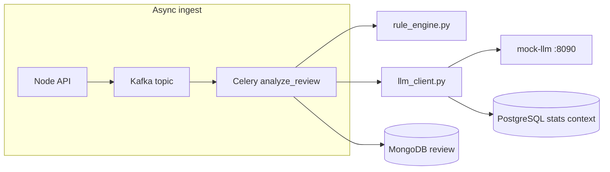

# Mock commercial LLM guide (OpenAI-compatible, zero cost)

This project scores suspicious emails using **rules + an LLM**. Local **Ollama** works but quality varies. **Commercial models** (OpenAI GPT-4o, Anthropic Claude, etc.) are stronger but cost money.

This repo includes a **mock commercial LLM**: an HTTP server that speaks the **OpenAI Chat Completions API** shape, returns canned JSON analyses, and charges **$0** — so you can demo authentication, model IDs, hyperparameters, and **database context in every prompt** without an API bill.

**Related:** [arch_guide_worker_pipeline.md](arch_guide_worker_pipeline.md), [tech_env_configuration.md](tech_env_configuration.md), [data_guide_kafka_events.md](data_guide_kafka_events.md), [graph_guide_neo4j_phishing.md](graph_guide_neo4j_phishing.md).

---

## Concepts for beginners

| Term | Meaning here |
|------|----------------|
| **LLM** | Large language model — predicts text; used here to classify phishing risk |
| **Provider** | Backend that serves the model (`ollama`, `mock_commercial`, or `disabled`) |
| **System prompt** | Instructions that shape model behavior (security analyst persona) |
| **Hyperparameters** | `temperature` (creativity), `max_tokens` (response length cap) |
| **Model ID** | Provider-specific name, e.g. `gpt-4o-mini` |
| **API key auth** | `Authorization: Bearer <LLM_API_KEY>` — same pattern as OpenAI |
| **Chat Completions** | OpenAI endpoint `POST /v1/chat/completions` with `messages[]` |
| **Prompt context** | Extra text appended to the user message from MongoDB + PostgreSQL |

---

## Architecture



| Component | Path |
|-----------|------|
| Celery task | `ai_service/app/tasks.py` |
| Provider factory | `ai_service/app/llm_client.py` |
| Mock HTTP server | `ai_service/mock_commercial_llm/server.py` |
| Stock responses | `ai_service/mock_commercial_llm/responses.py` |
| Node legacy worker | `backend/src/llm/llmProvider.js` |

---

## How database data is sent on every LLM query

This is the step-by-step path from stored data to the HTTP request body. Understanding this helps when debugging “why didn’t the model see my link?” or “why is PostgreSQL mentioned in the prompt?”.

### Step 1 — Celery loads the full review from MongoDB

When Kafka dispatches work, `analyze_review` in `tasks.py` runs:

```python
review = db.reviews.find_one({"_id": ObjectId(review_id)})
```

That BSON document is a **Python dict** passed to `analyze_with_llm(review)`. No separate Mongo round-trip happens inside `llm_client.py` — the worker already holds the document.

**Fields used in the prompt** (from the Mongo `reviews` collection):

| Mongo field | Used in prompt? | Purpose |
|-------------|-----------------|--------|
| `_id` | Yes (indirect) | Converted to string; drives PostgreSQL lookup |
| `senderEmail` | Yes | “Sender: …” line |
| `subject` | Yes | “Subject: …” line |
| `body` | Yes | Full email text |
| `links[]` | Yes | Bullet list under “Extracted links:” (populated at create time by `extractLinks.js`) |
| `analysisResult` | No | Not written yet when LLM runs |
| `status` | No | Worker sets `processing` before LLM call |

Links are **not** re-parsed in Python; they rely on the Node API having stored them when the review was created (`POST /reviews` → `extractLinks(body)` → Mongo).

### Step 2 — PostgreSQL context is fetched optionally

Function `_fetch_pg_context(review_id)` in `llm_client.py` connects with **psycopg** using `STATISTICS_PG_URL` and runs:

```sql
SELECT status, verdict, occurred_at::text
FROM review_stats_events
WHERE review_id = %s
ORDER BY occurred_at DESC
LIMIT 3
```

Those rows become human-readable lines, for example:

```text
PostgreSQL stats (recent events):
  status=processing verdict=None at=2026-05-24 12:00:00+00
  status=pending verdict=None at=2026-05-24 11:59:58+00
```

If the query fails (Postgres down, timeout), the prompt still goes out with a fallback line like `PostgreSQL stats unavailable: …` — scoring does **not** abort.

**Why PostgreSQL here?** Chart events are narrow rows written by `record_status()` in `stats.py` whenever status changes. The LLM demo shows how production systems often attach **operational telemetry** to prompts without dumping entire Mongo documents.

### Step 3 — User message assembly

`_build_user_prompt(review)` concatenates Mongo text + links + PG snippet + JSON instruction:

```text
Sender: user@example.com
Subject: Urgent verify
Body: Click https://evil.test/login now
Extracted links:
  - https://evil.test/login

PostgreSQL stats (recent events):
  status=processing verdict=None at=...

Return STRICT JSON with keys: verdict, recommendedAction, summary, findings[], followUpQuestions[].
```

### Step 4 — OpenAI-shaped HTTP POST

`analyze_with_mock_commercial()` builds the JSON body:

```json
{
  "model": "gpt-4o-mini",
  "temperature": 0.2,
  "max_tokens": 512,
  "messages": [
    {
      "role": "system",
      "content": "You are a cybersecurity email analyst. Return strict JSON only."
    },
    {
      "role": "user",
      "content": "<the assembled string from Step 3>"
    }
  ]
}
```

Headers:

```http
Authorization: Bearer dev-mock-key
Content-Type: application/json
```

URL: `${LLM_BASE_URL}/chat/completions` (default `http://mock-llm:8090/v1/chat/completions`).

### Step 5 — Response parsing

The mock server returns `choices[0].message.content` as a JSON **string**. `_parse_json_content()` parses it (with a regex fallback if the model wraps JSON in prose). Metadata is attached under `_llmMeta` (`provider`, `model`, token counts, `mockCostUsd: 0`).

### Environment variables controlling DB context

| Variable | Affects |
|----------|---------|
| `STATISTICS_PG_URL` | PostgreSQL connection for `_fetch_pg_context` |
| `DISABLE_LLM` | When `true`, no HTTP call; stub verdict returned |
| `LLM_*` | Model, temperature, system prompt, API URL/key |

Mongo connection for the review itself is **not** configured in `llm_client.py` — it uses the dict Celery already loaded via `app/mongo.py` (`MONGO_URI` on the worker).

---

## Environment variables (full list)

| Variable | Default (dev) | Purpose |
|----------|---------------|---------|
| `DISABLE_LLM` | `true` | When `true`, skip all LLM HTTP (CI / deterministic runs) |
| `LLM_PROVIDER` | `mock_commercial` | `mock_commercial` or `ollama` when LLM enabled |
| `LLM_API_KEY` | `dev-mock-key` | Bearer token for mock server |
| `LLM_BASE_URL` | `http://mock-llm:8090/v1` | OpenAI-compatible base URL |
| `LLM_MODEL` | `gpt-4o-mini` | Model ID sent in JSON body |
| `LLM_SYSTEM_PROMPT` | analyst JSON prompt | System message content |
| `LLM_TEMPERATURE` | `0.2` | Lower = more deterministic mock picks |
| `LLM_MAX_TOKENS` | `512` | Caps response size (cost control pattern) |
| `STATISTICS_PG_URL` | postgres DSN in `.env.dev` | PostgreSQL stats snippet in user message |

---

## Enable mock LLM scoring locally

1. Start stack including `mock-llm` and `ai-celery`:

```bash
DEPLOYMENT_ENV=dev docker compose -f infra/docker/docker-compose.yml up -d mock-llm ai-celery ai-kafka-dispatch backend
```

2. In gitignored `backend/.env` (or export before compose):

```bash
DISABLE_LLM=false
LLM_PROVIDER=mock_commercial
```

3. Recreate workers:

```bash
DEPLOYMENT_ENV=dev docker compose -f infra/docker/docker-compose.yml up -d --force-recreate ai-celery
```

4. Submit a review with phishing-like text and a URL in the body — Celery should complete with a mock verdict; check worker logs for the outbound prompt size if debugging context.

---

## What the mock server implements

- `GET /health` — Docker / test health check
- `POST /v1/chat/completions` — requires `Authorization: Bearer ${LLM_API_KEY}`
- Returns OpenAI-shaped JSON with `choices[0].message.content` = analysis JSON string
- `usage` token counts and `mock_cost_usd: 0.0` for cost-awareness demos

The mock server does **not** read your databases itself — all Mongo/Postgres context is assembled in **`llm_client.py`** before the HTTP call. That mirrors real integrations where **your application** owns context retrieval and the vendor API only sees messages[].

---

## Tests (learning-oriented)

| File | Teaches |
|------|---------|
| `ai_service/tests/test_llm_client.py` | Provider factory, mocked HTTP, links + PG in prompt |
| `ai_service/tests/test_mock_commercial_llm.py` | Stock response rules, health route |
| `backend/__tests__/llmProvider.test.js` | Node BullMQ path parity |

Run: `ai_service/.venv/bin/pytest ai_service/tests/test_llm_client.py ai_service/tests/test_mock_commercial_llm.py -v`

---

## Switching to a real commercial API later

Set `LLM_BASE_URL` to the vendor URL and `LLM_API_KEY` to a real secret. The request shape already matches OpenAI Chat Completions — many providers are compatible. Keep `DISABLE_LLM=true` in CI. Context assembly in `_build_user_prompt` stays the same; only the remote endpoint and billing change.
