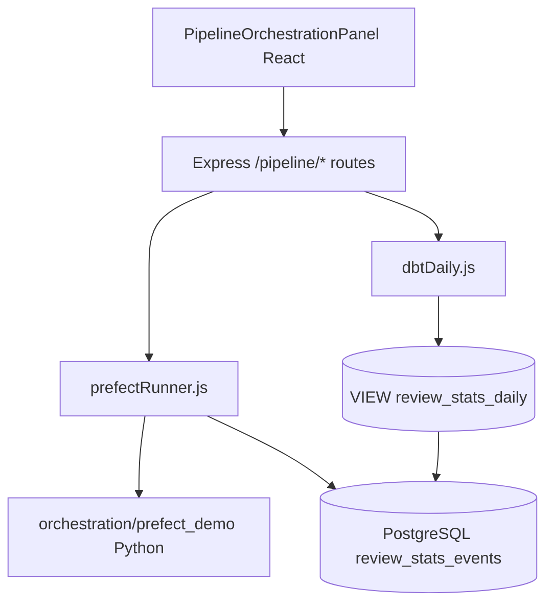

# Data orchestration with Prefect and dbt

This guide explains **Prefect** and **dbt** — two tools data platform teams use to keep analytics reliable — and how they are **wired into the Suspicious Email Triage React app**, not just left as standalone demos.

**Where to see it in the product:** sign in → **Analytics & graphs** (`#analytics`) → scroll to **Data pipeline (Prefect & dbt)**. That panel calls `GET /pipeline/prefect-health` and `GET /pipeline/dbt-daily`.

**Related:** [ui_guide_analytics_charts.md](ui_guide_analytics_charts.md), [arch_guide_features_catalog.md](arch_guide_features_catalog.md), [stack_guide_pre_push_verification.md](stack_guide_pre_push_verification.md).

---

## Novice primer — what are Prefect and dbt?

### Prefect (workflow orchestration)

Imagine a nightly job that must: check Postgres, run SQL transforms, email someone if counts are zero. You *could* use cron plus shell scripts, but when step 2 fails you get no retries, no run history, and no central UI.

**Prefect** is a **Python workflow orchestrator**. You write ordinary Python functions and decorate them:

| Decorator | Meaning | Analogy |
|-----------|---------|---------|
| `@task` | One retriable step (query DB, call API) | A single checklist item |
| `@flow` | Combines tasks; this is what you schedule | The whole checklist |

Prefect Cloud or a self-hosted server records each run, logs, duration, and failures. Alternatives include **Apache Airflow**, **Dagster**, and **Temporal**. This repo uses Prefect because the demo stays readable in a few files.

**In this repo:** flow name `review-stats-health-check` asks: *“How many `review_stats_events` rows arrived in the last N hours?”* — an ops sanity check before trusting charts.

### dbt (data build tool)

Analytics engineers often get raw tables from applications (`review_stats_events`) and need **clean daily rollups** for BI tools. **dbt** (data build tool) stores those transforms as **versioned SQL files** in Git:

| dbt concept | What it means |
|-------------|----------------|
| **Project** | Folder with `dbt_project.yml` — here `triage_dbt_demo` |
| **Source** | Declares upstream tables the app owns — `review_stats_events` |
| **Model** | A `SELECT` dbt materializes as a **view** or **table** — `review_stats_daily` |
| **Profile** | Connection settings (`profiles.yml`) — Postgres via `POSTGRES_*` env vars |

dbt does **not** copy data from MongoDB (no Extract/Load). It only **transforms** data already in the warehouse — the **T** in **ELT**: Extract (app) → Load (Postgres) → **Transform (dbt)**.

**In this repo:** model `review_stats_daily.sql` groups events by calendar day using PostgreSQL `date_trunc('day', occurred_at)`.

---

## How the triage app depends on Prefect and dbt

Previously this guide said the main app did not use these tools. **That is no longer true.** The analytics tab displays orchestration output through the Node API:



| Layer | File | Technology | Role |
|-------|------|------------|------|
| UI panel | `frontend/src/components/PipelineOrchestrationPanel.jsx` | React, Recharts | Shows Prefect metrics + dbt bar chart |
| API | `backend/src/api/pipeline.js` | Express | `metrics.read` permission |
| Prefect bridge | `backend/src/pipeline/prefectRunner.js` | child_process + Python | Runs `review_stats_flow` when Python available |
| dbt reader | `backend/src/pipeline/dbtDaily.js` | pg, CREATE VIEW | Ensures dbt model SQL as VIEW, then SELECT |
| SQL source of truth | `backend/src/pipeline/dbtViewSql.js` | Static SQL | Must match `orchestration/dbt_demo/models/review_stats_daily.sql` |
| Prefect flow | `orchestration/prefect_demo/flows.py` | Prefect `@flow` / `@task` (optional) | Health check task |
| dbt project | `orchestration/dbt_demo/` | dbt Core, Jinja SQL | Analytics engineering layout |

### Prefect execution paths

1. **Preferred (host dev with Python):** API spawns `ai_service/.venv/bin/python` (or `PIPELINE_PYTHON`) importing `review_stats_flow`. Response includes `"source": "prefect-flow"`.
2. **Docker / minimal API image:** Same SQL as `stats_task.py` runs in Node; response includes `"source": "nodejs-fallback"` and the same `flowName` so the UI still represents the Prefect contract.

Set `PIPELINE_PYTHON=/path/to/python` in your environment to force the interpreter on the API host.

### dbt execution paths

1. **Automatic (product path):** First call to `/pipeline/dbt-daily` runs `CREATE OR REPLACE VIEW review_stats_daily AS …` using SQL synced with the dbt model file.
2. **Analytics engineering path:** Run `dbt run --profiles-dir .` inside `orchestration/dbt_demo/` to materialize the same model via dbt CLI (recommended before promoting SQL changes).

---

## Shared data: `review_stats_events`

When analysts triage email, the Node API writes compact rows to PostgreSQL:

| Column | Example use |
|--------|-------------|
| `occurred_at` | Time bucketing (charts, dbt, Prefect window) |
| `event_type` | `review_created`, `status_changed` |
| `status` | Pipeline label for bar charts |
| `review_id` | Link back to MongoDB document |

Prefect counts rows in a sliding window. dbt aggregates by day. Recharts charts on the same tab read the same table via different API routes.

---

## REST API (authenticated)

Requires permission **`metrics.read`** (manager/admin roles).

### `GET /pipeline/prefect-health?hours=24`

Runs flow `review-stats-health-check`.

Example response:

```json
{
  "hours": 24,
  "eventCount": 150,
  "windowStart": "2026-05-27T12:00:00.000Z",
  "source": "prefect-flow",
  "flowName": "review-stats-health-check",
  "orchestrator": "prefect",
  "healthy": true,
  "status": "ok"
```

`status: "no_events"` when `eventCount` is zero (yellow badge in UI).

### `GET /pipeline/dbt-daily?limit=14`

Returns rows from dbt model `review_stats_daily`:

```json
{
  "model": "review_stats_daily",
  "project": "triage_dbt_demo",
  "materialization": "view",
  "source": "dbt-demo",
  "rows": [
    { "stats_day": "2026-05-27T00:00:00.000Z", "event_count": 42, "label": "5/27/2026" }
  ]
}
```

Example curl (use a JWT from login — see [auth_guide_obtain_jwt.md](auth_guide_obtain_jwt.md); never paste production secrets):

```bash
TOKEN="<jwt-from-login>"
curl -sS "http://localhost:3000/pipeline/prefect-health?hours=24" \
  -H "Authorization: Bearer ${TOKEN}"
```

---

## Run Prefect flow manually (CLI)

Postgres must be reachable (`localhost:5432` when Docker stack is up):

```bash
cd ~/suspicious-email-triage
PYTHONPATH=. POSTGRES_HOST=localhost POSTGRES_PASSWORD=triage \
  ai_service/.venv/bin/python -c "
from orchestration.prefect_demo.flows import review_stats_flow
print(review_stats_flow(24))
"
```

Optional: `pip install prefect` — same entrypoint registers in Prefect UI when you adopt a server.

---

## Run dbt manually (CLI)

```bash
pip install dbt-postgres
cd ~/suspicious-email-triage/orchestration/dbt_demo
POSTGRES_HOST=localhost POSTGRES_USER=triage POSTGRES_PASSWORD=triage POSTGRES_DB=triage_stats \
  dbt run --profiles-dir .
```

`dbt parse --profiles-dir .` validates project YAML without connecting.

---

## How Prefect and dbt fit together in production

Typical mature stack:

1. **Application** (Node) writes raw events — *implemented*
2. **dbt** builds rollups nightly (`dbt build` in CI) — *model defined; VIEW ensured by API in dev*
3. **Prefect** schedules dbt, freshness checks, and alerts — *health flow implemented; scheduling is ops follow-up*

Snowflake warehouse export ([data_guide_snowflake_analytics.md](data_guide_snowflake_analytics.md)) is a separate analytics path; dbt could target Snowflake in production instead of Postgres.

---

## Tests

| Test file | What it verifies |
|-----------|------------------|
| `backend/__tests__/pipelineApi.test.js` | Express `/pipeline/*` routes |
| `frontend/src/components/PipelineOrchestrationPanel.test.jsx` | UI renders Prefect + dbt sections |
| `orchestration/tests/test_prefect_demo.py` | Python flow + SQL mocking |
| `orchestration/tests/test_dbt_demo.py` | dbt project layout |

```bash
cd ~/suspicious-email-triage
bash scripts/test-all.sh
ai_service/.venv/bin/pytest orchestration/tests/ -v
```

---

## Security note

Documentation uses placeholders only. Postgres passwords belong in gitignored `backend/dev.secrets`, not in markdown.

---

## Command you can run (this guide) {#run-one-command}

<div style="background:#eef1f5;padding:1rem 1.25rem;border-left:4px solid #64748b;margin:1rem 0;border-radius:4px;">

<p><strong>Run in terminal</strong> — open analytics with pipeline panel after sign-in</p>

```bash
cd ~/suspicious-email-triage
curl -sS http://localhost:3000/health/live
# Then browse http://localhost:3001/#analytics (metrics.read required)
```

</div>
