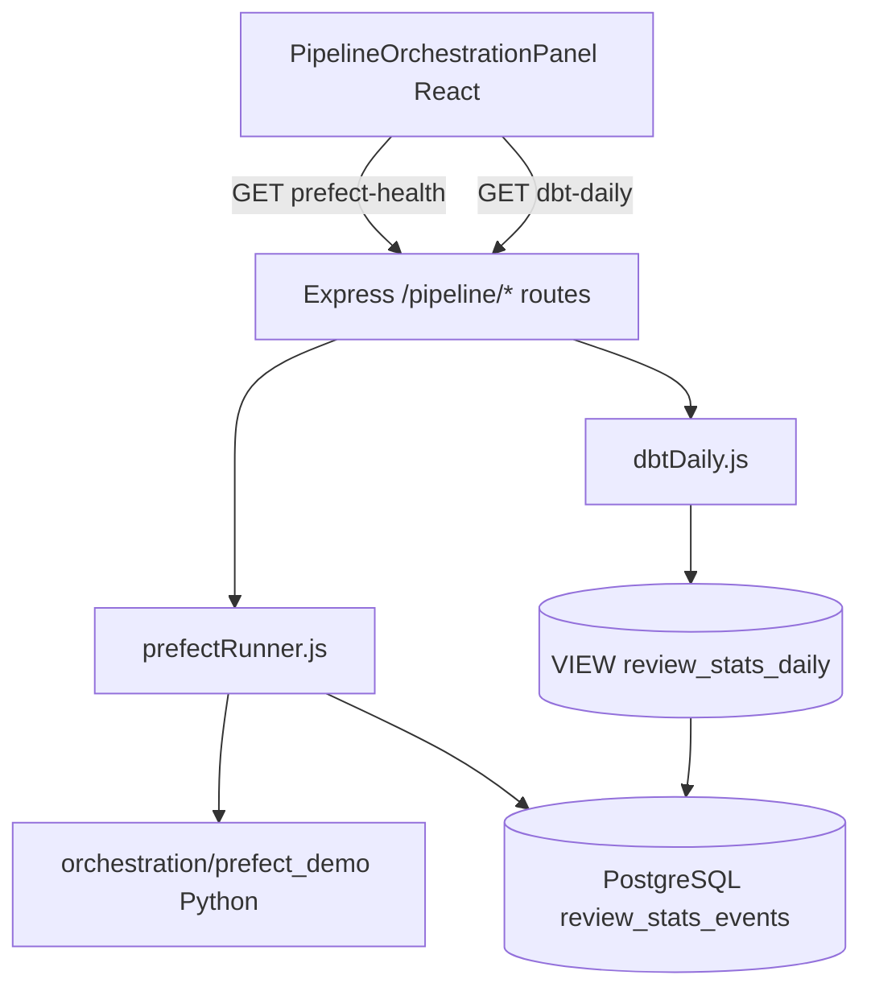

# Data orchestration with Prefect and dbt

This guide explains **Prefect** and **dbt** — two tools data platform teams use to keep analytics reliable — and how they are **wired into the Suspicious Email Triage React app** on the Analytics tab.

**Where to see it:** sign in → **Analytics & graphs** (`#analytics`) → scroll to **Data pipeline (Prefect & dbt)**.

**Related:** [ui_guide_analytics_charts.md](ui_guide_analytics_charts.md), [arch_guide_features_catalog.md](arch_guide_features_catalog.md), [ops_guide_s3_backups.md](ops_guide_s3_backups.md).

---

## Primer — what are Prefect and dbt?

### Prefect (workflow orchestration)

Imagine your team needs a job that runs every night:

1. Connect to PostgreSQL.
2. Count how many `review_stats_events` rows arrived in the last 24 hours.
3. If the count is zero, mark the pipeline **unhealthy** so someone investigates before executives trust the charts.

You *could* use cron plus a shell script. When step 2 fails, cron sends no structured history, no automatic retries, and no single place to see past runs.

**Prefect** is a **Python workflow orchestrator**. You write normal Python functions and mark them with decorators:

| Decorator | Meaning | Analogy |
|-----------|---------|---------|
| `@task` | One retriable step (query DB, call API) | A single checklist item |
| `@flow` | Combines tasks; this is what you schedule | The whole checklist |

Prefect Cloud or a self-hosted server records each run: start time, duration, logs, success/failure.

**Alternatives:** **Apache Airflow**, **Dagster**, and **Temporal** solve the same class of problem. Airflow is powerful but usually expects a scheduler service, DAG folders, and more boilerplate before you can run one health check. Dagster and Temporal are excellent for larger platforms but add concepts (assets, durable workflows) that are heavier than this project needs for a first teaching example.

**Why this repository uses Prefect for the demo:** the entire health-check workflow lives in roughly **one Python module** (`orchestration/prefect_demo/flows.py`). You decorate two small functions (`@task` for the SQL count, `@flow` for the wrapper), call the flow from the Node API or a one-line CLI, and the Analytics panel can display the result. There is no separate DAG repository layout, no Airflow web UI to stand up, and no extra config files just to prove “orchestration + observability” alongside dbt. Prefect was chosen here because the whole orchestration story fits in **a few pages of Python** while still using industry patterns (`@task`, `@flow`, named runs, retries when you add a Prefect server later).

#### Concrete demo — Prefect input and output

**Input (what the flow reads):**

PostgreSQL table `review_stats_events` — one row each time a review is created or its status changes:

| occurred_at | event_type | status | review_id |
|-------------|------------|--------|-----------|
| 2026-06-01 09:00 | review_created | pending | 665a… |
| 2026-06-01 09:05 | status_changed | completed | 665a… |

**Flow logic (simplified):**

```python
@task
def count_recent_events(hours: int) -> int:
    # SELECT count(*) FROM review_stats_events WHERE occurred_at >= now() - hours

@flow(name="review-stats-health-check")
def review_stats_flow(hours: int = 24):
    n = count_recent_events(hours)
    return {"eventCount": n, "healthy": n > 0}
```

**Output (what the UI displays):**

```json
{
  "flowName": "review-stats-health-check",
  "eventCount": 150,
  "hours": 24,
  "status": "ok",
  "healthy": true,
  "source": "prefect-flow"
}
```

If `eventCount` is `0`, status becomes `no_events` and the UI shows a yellow badge — meaning charts may be empty because ingestion stopped, not because email traffic is genuinely zero.

---

### dbt (data build tool)

Analytics engineers receive **raw event tables** from applications. Executives want **daily rollups** — one row per calendar day with total events — for bar charts and BI tools.

**dbt** (data build tool) stores transforms as **versioned SQL files** in Git:

| dbt concept | What it means |
|-------------|----------------|
| **Project** | Folder with `dbt_project.yml` — here `orchestration/dbt_demo` |
| **Source** | Declares upstream tables the app owns — `review_stats_events` |
| **Model** | A `SELECT` dbt materializes as a **view** or **table** — `review_stats_daily` |
| **Profile** | Connection settings (`profiles.yml`) — Postgres via `POSTGRES_*` env vars |

dbt does **not** copy data from MongoDB (no Extract/Load). It **transforms** data already in the warehouse — the **T** in **ELT**: Extract (app) → Load (Postgres) → **Transform (dbt)**.

#### Concrete demo — dbt input and output

**Input table:** same `review_stats_events` rows as above.

**Model SQL** (`review_stats_daily.sql` — simplified):

```sql
SELECT
  date_trunc('day', occurred_at) AS stats_day,
  count(*) AS event_count
FROM review_stats_events
GROUP BY 1
ORDER BY 1 DESC
```

**Output rows** (what `/pipeline/dbt-daily` returns to the UI):

| stats_day | event_count | label (UI) |
|-----------|-------------|------------|
| 2026-06-01 | 42 | 6/1/2026 |
| 2026-05-31 | 38 | 5/31/2026 |

The Analytics panel renders these as a **Recharts bar chart** — green bars, one per day.

---

## How the triage app uses Prefect and dbt

The Analytics tab embeds `PipelineOrchestrationPanel.jsx`, which calls two Express routes:


```mermaid
flowchart TB
  UI[PipelineOrchestrationPanel React]
  API[Express /pipeline/* routes]
  PF[prefectRunner.js]
  DBT[dbtDaily.js]
  PY[orchestration/prefect_demo Python]
  PG[(PostgreSQL review_stats_events)]
  VIEW[(VIEW review_stats_daily)]

  UI -->|GET prefect-health| API
  UI -->|GET dbt-daily| API
  API --> PF
  API --> DBT
  PF --> PY
  PF --> PG
  DBT --> VIEW
  VIEW --> PG
```

### UI layout (what you see on screen)

The panel has two cards side by side:

**Left card — Prefect health**

| Label on screen | JSON field | Example value |
|-----------------|------------|---------------|
| Events in window | `eventCount` | `150` |
| Window (hours) | `hours` | `24` |
| Status | `status` | `ok` or `no_events` |
| Executed via | `source` | `prefect-flow` or `nodejs-fallback` |
| Flow name | `flowName` | `review-stats-health-check` |

**Right card — dbt daily chart**

| Label on screen | JSON field | Example |
|-----------------|------------|---------|
| Project | `project` | `triage_dbt_demo` |
| Materialization | `materialization` | `view` |
| Bar chart X axis | `rows[].label` | `6/1/2026` |
| Bar chart Y axis | `rows[].event_count` | `42` |

**Refresh pipeline data** re-fetches both endpoints.

### Roles and permissions

| Requirement | Permission | Typical role |
|-------------|------------|--------------|
| View Analytics tab | `metrics.read` | manager, admin |
| See pipeline panel | Same — panel is part of Analytics | manager, admin |

There is no separate Prefect login inside the triage app. Operators use JWT auth; the Node API bridges to Python/dbt on their behalf.

### Execution paths

#### Prefect

1. **Python path (preferred when interpreter available):** `prefectRunner.js` spawns `ai_service/.venv/bin/python` (or `PIPELINE_PYTHON`), imports `review_stats_flow`, returns `"source": "prefect-flow"`.
2. **Node fallback (Docker API image without Python):** Same SQL count runs in Node; response includes `"source": "nodejs-fallback"` and the same `flowName` so the UI contract stays stable.

Set `PIPELINE_PYTHON=/path/to/python` to force the interpreter on the API host.

#### dbt

1. **Automatic product path:** First call to `/pipeline/dbt-daily` runs `CREATE OR REPLACE VIEW review_stats_daily AS …` using SQL synced with `orchestration/dbt_demo/models/review_stats_daily.sql`.
2. **Analytics engineering path:** Run `dbt run --profiles-dir .` inside `orchestration/dbt_demo/` to materialize via dbt CLI before promoting SQL changes.

---

## Shared data: `review_stats_events`

When analysts triage email, the Node API writes compact rows to PostgreSQL:

| Column | Example use |
|--------|-------------|
| `occurred_at` | Time bucketing (charts, dbt, Prefect window) |
| `event_type` | `review_created`, `status_changed` |
| `status` | Pipeline label for bar charts |
| `review_id` | Link back to MongoDB document |

Prefect counts rows in a sliding window. dbt aggregates by day. Other charts on the Analytics tab read the same table through different routes.

---

## REST API (authenticated)

Requires permission **`metrics.read`**.

### `GET /pipeline/prefect-health?hours=24`

Runs flow `review-stats-health-check`.

```json
{
  "hours": 24,
  "eventCount": 150,
  "windowStart": "2026-05-27T12:00:00.000Z",
  "source": "prefect-flow",
  "flowName": "review-stats-health-check",
  "orchestrator": "prefect",
  "healthy": true,
  "status": "ok"
}
```

### `GET /pipeline/dbt-daily?limit=14`

```json
{
  "model": "review_stats_daily",
  "project": "triage_dbt_demo",
  "materialization": "view",
  "source": "dbt-demo",
  "rows": [
    { "stats_day": "2026-05-27T00:00:00.000Z", "event_count": 42, "label": "5/27/2026" }
  ]
}
```

Example curl (JWT from login — see [auth_guide_obtain_jwt.md](auth_guide_obtain_jwt.md)):

```bash
TOKEN="<jwt-from-login>"
curl -sS "http://localhost:3000/pipeline/prefect-health?hours=24" \
  -H "Authorization: Bearer ${TOKEN}"
```

---

## Run Prefect flow manually (CLI)

PostgreSQL must be reachable (`localhost:5432` when Docker stack is up):

```bash
cd ~/suspicious-email-triage
PYTHONPATH=. POSTGRES_HOST=localhost POSTGRES_PASSWORD=<from-dev-secrets> \
  ai_service/.venv/bin/python -c "
from orchestration.prefect_demo.flows import review_stats_flow
print(review_stats_flow(24))
"
```

Optional: `pip install prefect` — same entrypoint registers in Prefect UI when you adopt a server.

---

## Run dbt manually (CLI)

```bash
pip install dbt-postgres
cd ~/suspicious-email-triage/orchestration/dbt_demo
POSTGRES_HOST=localhost POSTGRES_USER=triage POSTGRES_PASSWORD=<from-dev-secrets> POSTGRES_DB=triage_stats \
  dbt run --profiles-dir .
```

`dbt parse --profiles-dir .` validates project YAML without connecting.

---

## How Prefect and dbt fit together in production

### Demo scenario — nightly analytics health

**06:00 UTC — Prefect scheduled flow**

1. Flow `review-stats-health-check` runs on a Prefect worker (or Lambda/container).
2. Task queries Postgres: `eventCount = 1240` for the last 24 hours.
3. Prefect marks run **Completed**; if count were 0, PagerDuty alert fires.

**06:15 UTC — dbt scheduled build**

1. CI or Prefect triggers `dbt build` in `orchestration/dbt_demo`.
2. Model `review_stats_daily` refreshes — one row per day for the last 90 days.
3. BI tool (Looker, Metabase) reads `review_stats_daily` instead of scanning raw events.

**09:00 UTC — SOC manager opens triage app**

1. Signs in → `#analytics`.
2. Prefect card shows `status: ok`, `eventCount: 1240`.
3. dbt chart shows rising bars for the last two weeks.
4. Manager trusts dashboards because both **freshness check** (Prefect) and **rollup** (dbt) succeeded.

| Layer | Tool | Status in this repo |
|-------|------|---------------------|
| Raw events | Node API → Postgres | Implemented |
| Freshness check | Prefect flow + `/pipeline/prefect-health` | Implemented |
| Daily rollup | dbt model + `/pipeline/dbt-daily` VIEW | Implemented |
| Scheduling | Prefect Cloud / cron / CI | Ops follow-up |
| Warehouse | Snowflake export optional | [data_guide_snowflake_analytics.md](data_guide_snowflake_analytics.md) |

---

## Tests

| Test file | What it verifies |
|-----------|------------------|
| `backend/__tests__/pipelineApi.test.js` | Express `/pipeline/*` routes |
| `frontend/src/components/PipelineOrchestrationPanel.test.jsx` | UI renders Prefect + dbt sections |
| `orchestration/tests/test_prefect_demo.py` | Python flow + SQL mocking |
| `orchestration/tests/test_dbt_demo.py` | dbt project layout |

```bash
cd ~/suspicious-email-triage
bash scripts/test-all.sh
ai_service/.venv/bin/pytest orchestration/tests/ -v
```

---

## Security note

Documentation uses placeholders only. Postgres passwords belong in gitignored `backend/dev.secrets`, not in markdown.

---

## Command you can run (this guide) {#run-one-command}

<div style="background:#eef1f5;padding:1rem 1.25rem;border-left:4px solid #64748b;margin:1rem 0;border-radius:4px;">

<p><strong>Run in terminal</strong> — open analytics with pipeline panel after sign-in</p>

```bash
cd ~/suspicious-email-triage
curl -sS http://localhost:3000/health/live
# Then browse http://localhost:3000/#analytics (metrics.read required)
```

</div>
