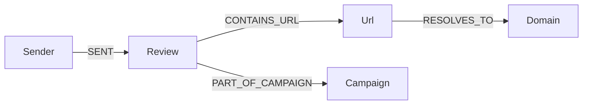

# Neo4j phishing relationship graph

This guide explains how the project uses **Neo4j** (a graph database) to connect emails, senders, URLs, domains, and phishing **campaigns**. If you are new to graph databases, read the “Concepts for beginners” section first — it defines every term used later.

**Related docs:** [arch_guide_overview.md](arch_guide_overview.md), [arch_guide_worker_pipeline.md](arch_guide_worker_pipeline.md), [data_guide_mock_llm.md](data_guide_mock_llm.md), [ui_guide_analytics_charts.md](ui_guide_analytics_charts.md), [tech_neo4j_setup_wsl_windows.md](tech_neo4j_setup_wsl_windows.md), [graph_demo_neo4j_phishing.md](graph_demo_neo4j_phishing.md).

---

## Concepts for beginners

| Term | What it means in this project |
|------|-------------------------------|
| **Graph database** | Stores data as **nodes** (things) and **relationships** (connections). Good for “who sent what” and “which URLs appear together”. |
| **Node** | One entity — e.g. a `Sender`, `Review`, `Url`, `Domain`, or `Campaign`. |
| **Relationship (edge)** | A directed link — e.g. `(Sender)-[:SENT]->(Review)`. |
| **Cypher** | Neo4j’s query language (like SQL for graphs). We use `MERGE` for idempotent upserts. |
| **Bolt** | Neo4j’s binary protocol; the Node **neo4j-driver** connects on port **7687**. |
| **Campaign** | A cluster of reviews that share a suspicious **domain** indicator (same phishing infrastructure reused). |
| **Shared indicator** | A domain (or future: sender hash, URL path) reused across multiple risky reviews. |

---

## Why a graph here?

MongoDB stores each review as one document. PostgreSQL stores narrow **statistics events** for charts. Neither makes it easy to ask: “Show me every review that used the same domain as this one” or “Which senders hit the same URL host?”

Neo4j answers those questions with traversals — walking relationships instead of heavy joins or full collection scans.

---

## Data model (implemented pattern)



| Node label | Key property | Meaning |
|------------|--------------|---------|
| `Sender` | `email` | From address (normalized lowercase) |
| `Review` | `id` | MongoDB review `_id` string |
| `Url` | `href` | Full http(s) link extracted from body |
| `Domain` | `host` | Hostname parsed via WHATWG `URL` (Node) |
| `Campaign` | `indicator` | Shared domain when ≥2 risky reviews link to it |

| Relationship | Meaning |
|--------------|---------|
| `SENT` | Sender submitted this review |
| `CONTAINS_URL` | Review body contained this URL |
| `RESOLVES_TO` | URL hostname maps to this domain node |
| `PART_OF_CAMPAIGN` | Review belongs to a shared-indicator cluster |

**Risky verdicts** for campaign detection: `suspicious`, `likely_phishing` (see `campaignDetection.js`).

---

## When data is synced

1. **Review created** — Node API saves Mongo document, enqueues Kafka, then **schedules** graph sync (`scheduleGraphSync` in `reviews.js`). Initial sync may have `verdict = null` until analysis finishes.
2. **Celery completes** — Python worker writes `analysisResult` to Mongo, then POSTs to **`/graph/internal/sync/:id`** with service token so the graph gets the final verdict and campaign links.
3. **Analyst override** — Saving an override re-syncs the review so graph verdict matches human decision.

Internal sync is mounted **before** JWT middleware so workers do not need a user token — only `X-Graph-Internal-Token`.

---

## Environment variables

Values for passwords and service tokens live in **`backend/.env.dev`** (committed template) and optional gitignored **`backend/.env`** (local overrides). **Do not copy secrets into documentation or chat logs** — open the files on your machine.

| Variable | Purpose |
|----------|---------|
| `NEO4J_ENABLED` | When `false`, graph sync and queries are skipped (CI without Neo4j). |
| `NEO4J_URI` | Bolt URL for `neo4j-driver` (`bolt://neo4j:7687` inside Docker). |
| `NEO4J_USER` | Neo4j username. |
| `NEO4J_PASSWORD` | Neo4j password — **read locally**, never commit production values. |
| `GRAPH_INTERNAL_TOKEN` | Shared secret for Celery → `/graph/internal/sync` — **keep private**. |
| `BACKEND_INTERNAL_URL` | Base URL Celery uses to reach the Node API. |

Full WSL + Windows client setup: [tech_neo4j_setup_wsl_windows.md](tech_neo4j_setup_wsl_windows.md).

---

## Docker

Neo4j runs as service `neo4j` in `infra/docker/docker-compose.yml`:

- **Browser UI:** http://localhost:7474 (credentials from your local env — see [tech_neo4j_setup_wsl_windows.md](tech_neo4j_setup_wsl_windows.md))
- **Bolt:** `localhost:7687` (Windows GUI tools and drivers)

Start the graph with the rest of the stack:

<div style="background:#eef1f5;padding:1rem 1.25rem;border-left:4px solid #64748b;margin:1rem 0;border-radius:4px;">

<p><strong>Run in terminal</strong> — WSL, repository root</p>

```bash
cd ~/suspicious-email-triage
DEPLOYMENT_ENV=dev docker compose -f infra/docker/docker-compose.yml up -d neo4j backend ai-celery
```

</div>

---

## HTTP API (JWT required except internal sync)

All routes under `/graph` require permission **`graph.read`** (seeded for analyst, manager, developer, viewer, admin).

| Method | Path | Description |
|--------|------|-------------|
| GET | `/graph/status` | Whether Neo4j is enabled |
| GET | `/graph/campaigns` | Shared-indicator campaign list |
| GET | `/graph/review/:id/neighborhood` | Subgraph around one review |
| GET | `/graph/visualization` | Nodes + edges for the React SVG view |
| POST | `/graph/sync/:id` | Manual re-sync (troubleshooting) |
| POST | `/graph/internal/sync/:id` | **No JWT** — `X-Graph-Internal-Token` only |

---

## Frontend visualization

Open the triage app → **Phishing graph** tab (`#graph` in the URL hash).

`GraphView.jsx` fetches `/graph/visualization` and `/graph/campaigns`, then draws:

- **Nodes** on a circle (color by type: Sender, Review, Url, Domain, Campaign)
- **Edges** as lines labeled by relationship type in the API payload

This is intentionally lightweight (plain SVG, no D3) so the demo stays easy to maintain.

---

## Code map

| Area | Source path | Run its unit tests (terminal) |
|------|-------------|-------------------------------|
| Bolt driver singleton | `backend/src/graph/neo4jClient.js` | `cd ~/suspicious-email-triage/backend && npm test -- --watchAll=false --testPathPattern=neo4jParams` |
| Review → Cypher upsert | `backend/src/graph/syncReview.js` | `cd ~/suspicious-email-triage/backend && npm test -- --watchAll=false --testPathPattern=graphSync` |
| Campaign detection | `backend/src/graph/campaignDetection.js` | `cd ~/suspicious-email-triage/backend && npm test -- --watchAll=false --testPathPattern=campaignDetection` |
| Read queries / viz JSON | `backend/src/graph/graphQueries.js` | `cd ~/suspicious-email-triage/backend && npm test -- --watchAll=false --testPathPattern=graphApi` |
| Domain parsing | `backend/src/graph/domainFromUrl.js` | `cd ~/suspicious-email-triage/backend && npm test -- --watchAll=false --testPathPattern=domainFromUrl` |
| Public REST routes | `backend/src/api/graph.js` | `cd ~/suspicious-email-triage/backend && npm test -- --watchAll=false --testPathPattern=graphApi` |
| Internal worker route | `backend/src/api/graphInternal.js` | `cd ~/suspicious-email-triage/backend && npm test -- --watchAll=false --testPathPattern=graphInternal` |
| Celery callback | `ai_service/app/graph_sync.py` | `cd ~/suspicious-email-triage && ai_service/.venv/bin/pytest ai_service/tests/test_graph_sync.py -v` |
| React UI | `frontend/src/views/GraphView.jsx` | *(manual — use [graph_demo_neo4j_phishing.md](graph_demo_neo4j_phishing.md))* |

Jest matches **test files** under `backend/__tests__/`, not `src/` paths directly. Pattern details: [stack_guide_running_tests.md — Map backend/src → Jest](stack_guide_running_tests.md#map-backendsrc--jest-command).

---

## Tests {#tests}

<div style="background:#eef1f5;padding:1rem 1.25rem;border-left:4px solid #64748b;margin:1rem 0;border-radius:4px;">

<p><strong>Run in terminal</strong> — campaign detection (<code>campaignDetection.js</code>) + mock LLM phishing rules</p>

```bash
cd ~/suspicious-email-triage
bash scripts/verify-campaign-detection.sh
```

</div>

<div style="background:#eef1f5;padding:1rem 1.25rem;border-left:4px solid #64748b;margin:1rem 0;border-radius:4px;">

<p><strong>Run in terminal</strong> — Jest only for <code>backend/src/graph/campaignDetection.js</code></p>

```bash
cd ~/suspicious-email-triage/backend
npm test -- --watchAll=false --testPathPattern=campaignDetection
```

</div>

| Test file | What it verifies |
|-----------|------------------|
| `backend/__tests__/domainFromUrl.test.js` | URL → hostname parsing — `--testPathPattern=domainFromUrl` |
| `backend/__tests__/graphSync.test.js` | Payload mapping + mocked Cypher — `--testPathPattern=graphSync` |
| `backend/__tests__/graphApi.test.js` | Authenticated graph routes — `--testPathPattern=graphApi` |
| `backend/__tests__/graphInternal.test.js` | Service token on internal sync — `--testPathPattern=graphInternal` |
| `ai_service/tests/test_graph_sync.py` | Celery HTTP callback — `ai_service/.venv/bin/pytest ai_service/tests/test_graph_sync.py -v` |
| `integration_tests/test_neo4j_graph.py` | Live Bolt (skipped if Neo4j down) — `ai_service/.venv/bin/pytest integration_tests/test_neo4j_graph.py -v` |

Full suite: `bash scripts/test-all.sh` — see [stack_guide_running_tests.md](stack_guide_running_tests.md).  
Manual demo: [graph_demo_neo4j_phishing.md](graph_demo_neo4j_phishing.md).

---

## Security notes

- **Service token:** Rotate `GRAPH_INTERNAL_TOKEN` in staging/prod; never expose it to browsers.
- **Graceful degradation:** If Neo4j is down, APIs return empty graph data and log warnings — triage still works.
- **RBAC:** Only roles with `graph.read` see the UI tab and API data.

---

## Troubleshooting

| Symptom | Likely cause | Fix |
|---------|--------------|-----|
| Empty graph | Neo4j not running or `NEO4J_ENABLED=false` | Start `neo4j` container; check backend logs |
| Campaigns never appear | Fewer than 2 risky reviews share a domain | Submit two reviews with the same phishing URL host |
| Celery never updates graph | Wrong `BACKEND_INTERNAL_URL` or internal token | Recreate `ai-celery` after env changes; see [tech_neo4j_setup_wsl_windows.md](tech_neo4j_setup_wsl_windows.md) |
| Red `graph_campaigns_failed` in UI | Neo4j down or backend needs rebuild after graph fixes | Commands in box below |

<div style="background:#eef1f5;padding:1rem 1.25rem;border-left:4px solid #64748b;margin:1rem 0;border-radius:4px;">

<p><strong>Run in terminal</strong> — check Neo4j and recreate backend</p>

```bash
cd ~/suspicious-email-triage
DEPLOYMENT_ENV=dev docker compose -f infra/docker/docker-compose.yml ps neo4j
DEPLOYMENT_ENV=dev docker compose -f infra/docker/docker-compose.yml up -d --force-recreate backend
```

</div>

Hands-on demo script: [graph_demo_neo4j_phishing.md](graph_demo_neo4j_phishing.md).

---

## Neo4j Browser (Cypher UI)

Step-by-step Browser usage (login, navigation, example Cypher, troubleshooting) lives in the technology guide so this file stays focused on **domain modeling and sync**:

**[tech_neo4j_browser_guide.md](tech_neo4j_browser_guide.md)** — open at [http://localhost:7474/browser/](http://localhost:7474/browser/) after starting the `neo4j` container.
