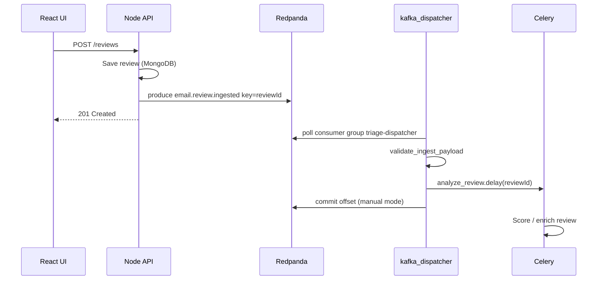

# Kafka event stream guide — topics, consumer groups, offsets, and reliability

This document explains how the Suspicious Email Triage project uses **Apache Kafka APIs** through **Redpanda** (a Kafka-compatible broker) to decouple the Node API from Python background scoring. No prior Kafka experience required — we define terms, show which files implement each pattern, and describe trade-offs in plain language.

**Technologies:** Redpanda (broker), kafka-python (Python consumer/producer), Node producer (`backend/src/kafka/`), Celery + Redis (task queue after dispatch).

**Related:** [worker-architecture.md](worker-architecture.md), [VERSIONS_BUILDS_AND_SIMULATION.md](VERSIONS_BUILDS_AND_SIMULATION.md), [pre_push_tests_and_stack_verification.md](pre_push_tests_and_stack_verification.md).

**Code package:** `ai_service/kafka_patterns/` — topic names, offset commits, validation, DLQ helpers.

**Tests:** `ai_service/tests/test_kafka_patterns.py` (unit, no broker).

---

## Why a message broker sits between API and workers

When an analyst submits a review:

1. The **HTTP request** must finish quickly — save to MongoDB/Postgres and return to the UI.
2. **Scoring** (LLM, rules, enrichment) can take seconds and should not block the browser.

**Pattern: transactional outbox / event-driven handoff**

```
[Node API]  --publish-->  [Kafka topic]  --consume-->  [Python dispatcher]  --enqueue-->  [Celery worker]
```

Kafka stores messages durably. If Celery workers are down, messages accumulate in the topic instead of being lost. When workers recover, the consumer group catches up.

---

## Vocabulary (with implementation mapping)

| Term | Plain meaning | This repo |
|------|---------------|-----------|
| **Broker** | Server that stores topics | Redpanda container `redpanda:9092` (host port `19092`) |
| **Topic** | Named log of messages | `email.review.ingested`, `email.review.ingested.dlq` |
| **Partition** | Shard of a topic for parallelism | Default **3** on ingest (`KAFKA_TOPIC_PARTITIONS`) |
| **Producer** | Client that appends messages | `backend/src/kafka/reviewIngestProducer.js` |
| **Consumer** | Client that reads messages | `ai_service/kafka_dispatcher.py` |
| **Consumer group** | Set of consumers sharing load | `triage-dispatcher` (`KAFKA_GROUP_DISPATCHER`) |
| **Offset** | Read cursor per partition | Committed manually after Celery enqueue (default) |
| **Key** | Optional bytes hashed to partition | `reviewId` — ordering per review |
| **DLQ** | Dead-letter queue topic | Invalid messages → `email.review.ingested.dlq` |

---

## Topic design

### Primary ingest topic

| Setting | Value |
|---------|-------|
| Name | `email.review.ingested` (`KAFKA_TOPIC_REVIEW_INGEST`) |
| Purpose | Signal: “review persisted, please score asynchronously” |
| Partitions | 3 in dev (env `KAFKA_TOPIC_PARTITIONS`) |
| Key | `reviewId` (MongoDB ObjectId string) |
| Value | JSON: `{"reviewId":"...","at":"ISO8601"}` |

**Pattern: partition key for per-entity ordering**

Messages with the same key go to the same partition. All events for one review stay ordered even with multiple partitions. Implementation: `partition_for_key()` in `ai_service/kafka_patterns/topics.py`.

### Dead-letter topic

| Setting | Value |
|---------|-------|
| Name | `email.review.ingested.dlq` |
| Partitions | 1 (ordering less important; forensics focus) |
| Payload | Wrapper JSON with `reason`, source offset, original bytes |

**Pattern: poison message isolation**

Bad JSON or missing `reviewId` must not block the main consumer loop forever. `publish_dlq()` in `reliability.py` copies the failure context for replay or debugging.

---

## Consumer groups

**Pattern: competing consumers**

Consumers with the same `group_id` coordinate partition ownership. Each partition is assigned to **at most one** consumer in the group at a time.

| Group | Service | Container |
|-------|---------|-----------|
| `triage-dispatcher` | Kafka → Celery bridge | `ai-kafka-dispatch` |

Scale-out experiment: run two dispatchers with the same group and 3 partitions — Kafka **rebalances** so each dispatcher owns ~1–2 partitions.

Env vars: `KAFKA_GROUP_DISPATCHER`, `KAFKA_BROKERS`.

---

## Offset management (reliability critical)

An **offset** is the next message position to read. **Committing** tells the broker: “this consumer group has finished processing up to here.”

| Mode | Env | Implementation | Semantics |
|------|-----|----------------|-----------|
| **Manual commit (default)** | `KAFKA_AUTO_COMMIT=false` | `commit_message_offset()` after successful `analyze_review.delay()` | **At-least-once** toward Celery — crash before commit → redelivery |
| Auto commit | `KAFKA_AUTO_COMMIT=true` | Broker commits on poll interval | Risk: message considered done before Celery enqueue |

**Pattern: commit after side effect**

Only commit Kafka offset **after** the downstream handoff (Celery enqueue) succeeds. See `kafka_dispatcher.py` loop and `offsets.py`.

Dev reset: `POST /dev/reset-local-state` (developer role) recreates topics with configured partition count.

---

## Reliability patterns (checklist)

| # | Pattern | File | Behavior |
|---|---------|------|----------|
| 1 | Payload validation | `reliability.validate_ingest_payload()` | Reject missing `reviewId` |
| 2 | DLQ routing | `reliability.publish_dlq()` | Poison messages off main topic |
| 3 | Partition key | Node producer + `topics.partition_for_key()` | Per-review ordering |
| 4 | Manual offset commit | `offsets.commit_message_offset()` | Retry on dispatcher crash |
| 5 | Soft-fail publish | Node producer | API logs if broker down; optional BullMQ fallback |

---

## End-to-end flow (one review)



---

## Try it locally

```bash
cd ~/suspicious-email-triage
DEPLOYMENT_ENV=dev docker compose -f infra/docker/docker-compose.yml up -d redpanda backend ai-kafka-dispatch ai-celery
docker compose -f infra/docker/docker-compose.yml logs -f ai-kafka-dispatch
```

Submit a review from the UI or API — watch dispatcher log `dispatched` and Celery `task start`.

---

## Pre-push tests

Unit tests validate payload rules and partition hashing without a broker — `ai_service/tests/test_kafka_patterns.py`. Full stack tests are optional when Docker is up — see [pre_push_tests_and_stack_verification.md](pre_push_tests_and_stack_verification.md).
