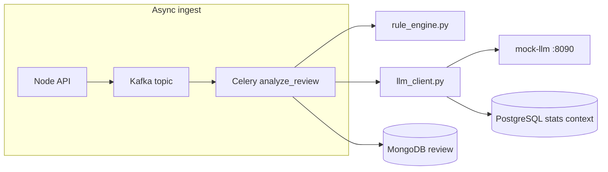

# Mock commercial LLM guide (OpenAI-compatible, zero cost)

This project scores suspicious emails using **rules + an LLM**. Local **Ollama** works but quality varies. **Commercial models** (OpenAI GPT-4o, Anthropic Claude, etc.) are stronger but cost money.

This repo includes a **mock commercial LLM**: an HTTP server that speaks the **OpenAI Chat Completions API** shape, returns canned JSON analyses, and charges **$0** — so you can demo authentication, model IDs, hyperparameters, and DB context without an API bill.

**Related:** [worker-architecture.md](worker-architecture.md), [env_configuration_guide.md](env_configuration_guide.md), [kafka_event_stream_guide.md](kafka_event_stream_guide.md).

---

## Concepts for beginners

| Term | Meaning here |
|------|----------------|
| **LLM** | Large language model — predicts text; used here to classify phishing risk |
| **Provider** | Backend that serves the model (`ollama`, `mock_commercial`, or `disabled`) |
| **System prompt** | Instructions that shape model behavior (security analyst persona) |
| **Hyperparameters** | `temperature` (creativity), `max_tokens` (response length cap) |
| **Model ID** | Provider-specific name, e.g. `gpt-4o-mini` |
| **API key auth** | `Authorization: Bearer <LLM_API_KEY>` — same pattern as OpenAI |
| **Chat Completions** | OpenAI endpoint `POST /v1/chat/completions` with `messages[]` |

---

## Architecture



| Component | Path |
|-----------|------|
| Celery task | `ai_service/app/tasks.py` |
| Provider factory | `ai_service/app/llm_client.py` |
| Mock HTTP server | `ai_service/mock_commercial_llm/server.py` |
| Stock responses | `ai_service/mock_commercial_llm/responses.py` |
| Node legacy worker | `backend/src/llm/llmProvider.js` |

---

## Environment variables

| Variable | Default (dev) | Purpose |
|----------|---------------|---------|
| `DISABLE_LLM` | `true` | When `true`, skip all LLM HTTP (CI / deterministic runs) |
| `LLM_PROVIDER` | `mock_commercial` | `mock_commercial` or `ollama` when LLM enabled |
| `LLM_API_KEY` | `dev-mock-key` | Bearer token for mock server |
| `LLM_BASE_URL` | `http://mock-llm:8090/v1` | OpenAI-compatible base URL |
| `LLM_MODEL` | `gpt-4o-mini` | Model ID sent in JSON body |
| `LLM_SYSTEM_PROMPT` | analyst JSON prompt | System message content |
| `LLM_TEMPERATURE` | `0.2` | Lower = more deterministic mock picks |
| `LLM_MAX_TOKENS` | `512` | Caps response size (cost control pattern) |

---

## Enable mock LLM scoring locally

1. Start stack including `mock-llm` and `ai-celery`:

```bash
DEPLOYMENT_ENV=dev docker compose -f infra/docker/docker-compose.yml up -d mock-llm ai-celery ai-kafka-dispatch backend
```

2. In gitignored `backend/.env` (or export before compose):

```bash
DISABLE_LLM=false
LLM_PROVIDER=mock_commercial
```

3. Recreate workers:

```bash
DEPLOYMENT_ENV=dev docker compose -f infra/docker/docker-compose.yml up -d --force-recreate ai-celery
```

4. Submit a review with phishing-like text (e.g. body contains "verify your password") — Celery logs should show completion with `likely_phishing` from mock rules.

---

## What the mock server implements

- `GET /health` — Docker / test health check
- `POST /v1/chat/completions` — requires `Authorization: Bearer ${LLM_API_KEY}`
- Returns OpenAI-shaped JSON with `choices[0].message.content` = analysis JSON string
- `usage` token counts and `mock_cost_usd: 0.0` for cost-awareness demos

**PostgreSQL context:** `llm_client.py` optionally queries `review_stats_events` for the same `review_id` and appends recent statuses to the user prompt (SQL + MongoDB pattern).

---

## Tests (learning-oriented)

| File | Teaches |
|------|---------|
| `ai_service/tests/test_llm_client.py` | Provider factory, mocked HTTP |
| `ai_service/tests/test_mock_commercial_llm.py` | Stock response rules, health route |
| `backend/__tests__/llmProvider.js` | Node BullMQ path parity |

Run: `ai_service/.venv/bin/pytest ai_service/tests/test_llm_client.py ai_service/tests/test_mock_commercial_llm.py -v`

---

## Switching to a real commercial API later

Set `LLM_BASE_URL` to the vendor URL and `LLM_API_KEY` to a real secret. The request shape already matches OpenAI Chat Completions — many providers are compatible. Keep `DISABLE_LLM=true` in CI.
