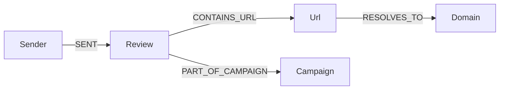

# Neo4j phishing relationship graph

This guide explains how the project uses **Neo4j** (a graph database) to connect emails, senders, URLs, domains, and phishing **campaigns**. If you are new to graph databases, read the “Concepts for beginners” section first — it defines every term used later.

**Related docs:** [architecture.md](architecture.md), [worker-architecture.md](worker-architecture.md), [mock_commercial_llm_guide.md](mock_commercial_llm_guide.md), [analytics_and_graphs_guide.md](analytics_and_graphs_guide.md), [neo4j_wsl_windows_setup_guide.md](neo4j_wsl_windows_setup_guide.md), [neo4j_phishing_graph_demo_guide.md](neo4j_phishing_graph_demo_guide.md).

---

## Concepts for beginners

| Term | What it means in this project |
|------|-------------------------------|
| **Graph database** | Stores data as **nodes** (things) and **relationships** (connections). Good for “who sent what” and “which URLs appear together”. |
| **Node** | One entity — e.g. a `Sender`, `Review`, `Url`, `Domain`, or `Campaign`. |
| **Relationship (edge)** | A directed link — e.g. `(Sender)-[:SENT]->(Review)`. |
| **Cypher** | Neo4j’s query language (like SQL for graphs). We use `MERGE` for idempotent upserts. |
| **Bolt** | Neo4j’s binary protocol; the Node **neo4j-driver** connects on port **7687**. |
| **Campaign** | A cluster of reviews that share a suspicious **domain** indicator (same phishing infrastructure reused). |
| **Shared indicator** | A domain (or future: sender hash, URL path) reused across multiple risky reviews. |

---

## Why a graph here?

MongoDB stores each review as one document. PostgreSQL stores narrow **statistics events** for charts. Neither makes it easy to ask: “Show me every review that used the same domain as this one” or “Which senders hit the same URL host?”

Neo4j answers those questions with traversals — walking relationships instead of heavy joins or full collection scans.

---

## Data model (implemented pattern)



| Node label | Key property | Meaning |
|------------|--------------|---------|
| `Sender` | `email` | From address (normalized lowercase) |
| `Review` | `id` | MongoDB review `_id` string |
| `Url` | `href` | Full http(s) link extracted from body |
| `Domain` | `host` | Hostname parsed via WHATWG `URL` (Node) |
| `Campaign` | `indicator` | Shared domain when ≥2 risky reviews link to it |

| Relationship | Meaning |
|--------------|---------|
| `SENT` | Sender submitted this review |
| `CONTAINS_URL` | Review body contained this URL |
| `RESOLVES_TO` | URL hostname maps to this domain node |
| `PART_OF_CAMPAIGN` | Review belongs to a shared-indicator cluster |

**Risky verdicts** for campaign detection: `suspicious`, `likely_phishing` (see `campaignDetection.js`).

---

## When data is synced

1. **Review created** — Node API saves Mongo document, enqueues Kafka, then **schedules** graph sync (`scheduleGraphSync` in `reviews.js`). Initial sync may have `verdict = null` until analysis finishes.
2. **Celery completes** — Python worker writes `analysisResult` to Mongo, then POSTs to **`/graph/internal/sync/:id`** with service token so the graph gets the final verdict and campaign links.
3. **Analyst override** — Saving an override re-syncs the review so graph verdict matches human decision.

Internal sync is mounted **before** JWT middleware so workers do not need a user token — only `X-Graph-Internal-Token`.

---

## Environment variables

Values for passwords and service tokens live in **`backend/.env.dev`** (committed template) and optional gitignored **`backend/.env`** (local overrides). **Do not copy secrets into documentation or chat logs** — open the files on your machine.

| Variable | Purpose |
|----------|---------|
| `NEO4J_ENABLED` | When `false`, graph sync and queries are skipped (CI without Neo4j). |
| `NEO4J_URI` | Bolt URL for `neo4j-driver` (`bolt://neo4j:7687` inside Docker). |
| `NEO4J_USER` | Neo4j username. |
| `NEO4J_PASSWORD` | Neo4j password — **read locally**, never commit production values. |
| `GRAPH_INTERNAL_TOKEN` | Shared secret for Celery → `/graph/internal/sync` — **keep private**. |
| `BACKEND_INTERNAL_URL` | Base URL Celery uses to reach the Node API. |

Full WSL + Windows client setup: [neo4j_wsl_windows_setup_guide.md](neo4j_wsl_windows_setup_guide.md).

---

## Docker

Neo4j runs as service `neo4j` in `infra/docker/docker-compose.yml`:

- **Browser UI:** http://localhost:7474 (credentials from your local env — see [neo4j_wsl_windows_setup_guide.md](neo4j_wsl_windows_setup_guide.md))
- **Bolt:** `localhost:7687` (Windows GUI tools and drivers)

Start the graph with the rest of the stack:

```bash
DEPLOYMENT_ENV=dev docker compose -f infra/docker/docker-compose.yml up -d neo4j backend ai-celery
```

---

## HTTP API (JWT required except internal sync)

All routes under `/graph` require permission **`graph.read`** (seeded for analyst, manager, developer, viewer, admin).

| Method | Path | Description |
|--------|------|-------------|
| GET | `/graph/status` | Whether Neo4j is enabled |
| GET | `/graph/campaigns` | Shared-indicator campaign list |
| GET | `/graph/review/:id/neighborhood` | Subgraph around one review |
| GET | `/graph/visualization` | Nodes + edges for the React SVG view |
| POST | `/graph/sync/:id` | Manual re-sync (troubleshooting) |
| POST | `/graph/internal/sync/:id` | **No JWT** — `X-Graph-Internal-Token` only |

---

## Frontend visualization

Open the triage app → **Phishing graph** tab (`#graph` in the URL hash).

`GraphView.jsx` fetches `/graph/visualization` and `/graph/campaigns`, then draws:

- **Nodes** on a circle (color by type: Sender, Review, Url, Domain, Campaign)
- **Edges** as lines labeled by relationship type in the API payload

This is intentionally lightweight (plain SVG, no D3) so the demo stays easy to maintain.

---

## Code map

| Area | Path |
|------|------|
| Bolt driver singleton | `backend/src/graph/neo4jClient.js` |
| Review → Cypher upsert | `backend/src/graph/syncReview.js` |
| Campaign detection | `backend/src/graph/campaignDetection.js` |
| Read queries / viz JSON | `backend/src/graph/graphQueries.js` |
| Domain parsing | `backend/src/graph/domainFromUrl.js` |
| Public REST routes | `backend/src/api/graph.js` |
| Internal worker route | `backend/src/api/graphInternal.js` |
| Celery callback | `ai_service/app/graph_sync.py` |
| React UI | `frontend/src/views/GraphView.jsx` |

---

## Tests

| File | What it verifies |
|------|------------------|
| `backend/__tests__/domainFromUrl.test.js` | URL → hostname parsing |
| `backend/__tests__/graphSync.test.js` | Payload mapping + mocked Cypher |
| `backend/__tests__/graphApi.test.js` | Authenticated graph routes |
| `backend/__tests__/graphInternal.test.js` | Service token on internal sync |
| `ai_service/tests/test_graph_sync.py` | Celery HTTP callback |
| `integration_tests/test_neo4j_graph.py` | Live Bolt check (skipped if Neo4j down) |

Run everything: [running_tests_guide.md](running_tests_guide.md).  
Try features manually: [neo4j_phishing_graph_demo_guide.md](neo4j_phishing_graph_demo_guide.md).

---

## Security notes

- **Service token:** Rotate `GRAPH_INTERNAL_TOKEN` in staging/prod; never expose it to browsers.
- **Graceful degradation:** If Neo4j is down, APIs return empty graph data and log warnings — triage still works.
- **RBAC:** Only roles with `graph.read` see the UI tab and API data.

---

## Troubleshooting

| Symptom | Likely cause | Fix |
|---------|--------------|-----|
| Empty graph | Neo4j not running or `NEO4J_ENABLED=false` | Start `neo4j` container; check backend logs |
| Campaigns never appear | Fewer than 2 risky reviews share a domain | Submit two reviews with the same phishing URL host |
| Celery never updates graph | Wrong `BACKEND_INTERNAL_URL` or internal token | Recreate `ai-celery` after env changes; see [neo4j_wsl_windows_setup_guide.md](neo4j_wsl_windows_setup_guide.md) |
| Red `graph_campaigns_failed` in UI | Neo4j down or backend needs rebuild after graph fixes | `docker compose ps neo4j`; `docker compose up -d --force-recreate backend` |

Hands-on demo script: [neo4j_phishing_graph_demo_guide.md](neo4j_phishing_graph_demo_guide.md).

---

## Neo4j Browser — novice guide (http://localhost:7474/browser/)

**Neo4j Browser** is the web UI shipped with Neo4j. You run **Cypher** queries and see nodes and relationships as a graph picture or as tables. This section is for developers who have never used it before.

**Install context:** Neo4j runs in Docker for this project — you do not install Browser separately. WSL + Windows access: [neo4j_wsl_windows_setup_guide.md](neo4j_wsl_windows_setup_guide.md).

### Open Browser

1. Start the `neo4j` service (see [Docker](#docker) above).
2. On **Windows 11**, open a normal browser (Edge, Chrome, Firefox).
3. Go to **http://localhost:7474/browser/**  
   (The older root `http://localhost:7474` may redirect here.)

Port **7474** is published from the `triage-neo4j` container to your machine.

### Log in (use env vars, not doc passwords)

Neo4j Browser asks for **connection URI**, **username**, and **password**.

| Field | What to enter |
|-------|----------------|
| Connect URL / URI | `bolt://localhost:7687` (Bolt from your PC into Docker) |
| Username | Value of **`NEO4J_USER`** in `backend/.env.dev` (template uses `neo4j`) |
| Password | Value of **`NEO4J_PASSWORD`** in `backend/.env.dev` — **read on your machine only**; never commit real production passwords |

If login fails:

- Confirm `docker compose ps neo4j` shows **Up**.
- Wait 20–30 seconds on first boot.
- Ensure you copied the password from **your** env file, not from an old chat log.

**Security habit:** Treat `NEO4J_PASSWORD` like any database secret. Rotate it in staging/prod; keep docs free of literal passwords.

### Navigation basics

After login you typically land on a **welcome** or **query** screen.

| UI area | Purpose |
|---------|---------|
| **Editor** (top) | Type Cypher; press **Ctrl+Enter** (Windows) or the **Run** ▶ button |
| **Graph** view | Circles (nodes) and arrows (relationships) — drag to rearrange |
| **Table** view | Same result as rows/columns — good for counts and IDs |
| **Text** view | Raw values when graph layout is crowded |
| **Database info** (sidebar) | Labels, relationship types, property keys — confirms data exists |
| **:help** commands | Type `:help` in the editor for built-in Browser cheatsheet |

Switch result mode with icons above the result pane (**graph**, **table**, **text**).

### Running your first query

Paste into the editor and run:

```cypher
RETURN 1 AS ok
```

**Expected:** One row, `ok = 1`. That proves Browser talks to the database.

### Example queries for this project

**Count nodes by label** (sanity check after demos):

```cypher
MATCH (n)
RETURN labels(n) AS label, count(*) AS cnt
ORDER BY cnt DESC
```

**List campaigns and linked review IDs** (matches backend campaign detection):

```cypher
MATCH (c:Campaign)<-[:PART_OF_CAMPAIGN]-(r:Review)
RETURN c.indicator AS campaign, collect(r.id) AS reviewIds, c.reviewCount AS count
```

**Sender → review → URL → domain chain** (typical phishing path):

```cypher
MATCH (s:Sender)-[:SENT]->(r:Review)-[:CONTAINS_URL]->(u:Url)-[:RESOLVES_TO]->(d:Domain)
RETURN s.email AS sender, r.id AS reviewId, u.href AS url, d.host AS domain
LIMIT 25
```

**Visualize a small subgraph** (graph view works best with a LIMIT):

```cypher
MATCH (n)-[r]->(m)
RETURN n, r, m
LIMIT 50
```

**Find one review by Mongo id** (replace the id with a value from the triage UI):

```cypher
MATCH (r:Review {id: "PASTE_MONGO_REVIEW_ID_HERE"})
OPTIONAL MATCH (r)-[rel]-(neighbor)
RETURN r, rel, neighbor
LIMIT 100
```

### Reading results

| You see | Meaning |
|---------|---------|
| `(:Review {id: "..."})` | A review node; `id` is the MongoDB string |
| `[:SENT]`, `[:CONTAINS_URL]`, etc. | Relationship types from the [data model](#data-model-implemented-pattern) |
| `(:Campaign {indicator: "host.example"})` | Shared domain (or indicator) for a campaign cluster |
| Empty graph, zero rows | Neo4j empty, sync not run, or `NEO4J_ENABLED=false` on backend — submit reviews and wait for `completed` |
| Red error in Browser | Syntax error in Cypher, or wrong property name — read the message; fix typos |

**Table view tips:** Use it to copy `reviewId` values into curl commands or the triage UI. **Graph view tips:** Double-click a node to expand neighbors (Browser feature); use LIMIT so layout stays readable.

### Common mistakes

| Mistake | Fix |
|---------|-----|
| Using `http://localhost:7474` as Bolt URI | Bolt is **`bolt://localhost:7687`**, not HTTP |
| Querying before Celery finishes | Graph may lack final `PART_OF_CAMPAIGN` until verdict is risky and domain is shared |
| Forgetting `LIMIT` | Large graphs slow Browser; always cap exploratory queries |
| Expecting passwords in this doc | Open `backend/.env.dev` locally |

### Verify the same data via API

JWT-authenticated routes (`GET /graph/campaigns`, `GET /graph/visualization`) return JSON derived from the same graph. Browser is best for **ad hoc Cypher**; the React **Phishing graph** tab is best for demos to non-technical stakeholders.

Automated checks: [running_tests_guide.md](running_tests_guide.md) and [neo4j_phishing_graph_demo_guide.md](neo4j_phishing_graph_demo_guide.md) (campaign verification script).
