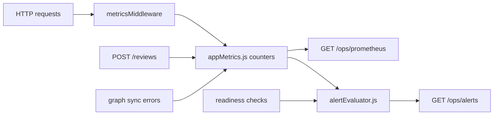

# Metrics and alerting guide

This guide covers the **in-process metrics and dev-friendly alerts** from [TBD §1.4](roadmap_tbd.md#14-metrics-and-alerting-p1). You get Prometheus-style scraping and JSON alerts **without** Datadog or Grafana Cloud — though you can point Prometheus/Grafana at the same endpoints later.

**Related:** [ops_guide_health_uptime.md](ops_guide_health_uptime.md), [auth_guide_rbac.md](auth_guide_rbac.md), [ops_guide_central_logging.md](ops_guide_central_logging.md).

---

## Architecture (free path)



| Component | File | Role |
|-----------|------|------|
| Counters/gauges | `backend/src/lib/appMetrics.js` | In-memory registry (resets on restart) |
| Request counting | `backend/src/http/middleware/metrics.js` | Increments totals and 5xx errors |
| Review creates | `backend/src/api/reviews.js` | `incrementReviewsCreated()` |
| Graph sync | `backend/src/services/graphSyncService.js` | `incrementGraphSyncFailures()` |
| Alert rules | `backend/src/lib/alertEvaluator.js` | Thresholds + readiness |
| Routes | `backend/src/api/ops.js` | `/ops/prometheus`, `/ops/alerts` |

---

## In-process counters (`appMetrics.js`)

Counters live in a single Node process — suitable for **dev, staging, and small demos**. They are **not** durable across restarts (unlike a real Prometheus TSDB).

| Metric (Prometheus name) | Type | When it changes |
|--------------------------|------|-----------------|
| `triage_http_requests_total` | counter | Each HTTP request (middleware) |
| `triage_http_errors_total` | counter | Each response with status ≥ 500 |
| `triage_reviews_created_total` | counter | Successful review creation |
| `triage_graph_sync_failures_total` | counter | Graph sync failure path |
| `triage_readiness_status` | gauge | `1` if last alert evaluation saw readiness ok, else `0` |
| `triage_process_uptime_seconds` | gauge | Seconds since process start |

---

## `GET /ops/prometheus` (public scrape)

**Route:** `GET /ops/prometheus`  
**Auth:** None (standard Prometheus scrape pattern — protect at network edge in production).  
**Content-Type:** `text/plain; version=0.0.4; charset=utf-8`

```bash
curl -sS http://localhost:3000/ops/prometheus
```

Example excerpt:

```text
# HELP triage_http_requests_total Total HTTP requests observed by metrics middleware.
# TYPE triage_http_requests_total counter
triage_http_requests_total 42
# HELP triage_http_errors_total Total HTTP 5xx responses.
# TYPE triage_http_errors_total counter
triage_http_errors_total 0
...
```

**Local Prometheus (optional):** run Prometheus in Docker, add a scrape job `http://backend:3000/ops/prometheus`, visualize in Grafana — TBD’s “Grafana Cloud free tier / local Prometheus” path.

---

## `GET /ops/alerts` (authenticated JSON)

**Route:** `GET /ops/alerts`  
**Permission:** `metrics.read` (e.g. **manager** or **admin** per RBAC)  
**Auth:** `Authorization: Bearer <JWT>`

Evaluates simple rules on each request:

| Alert `id` | Severity | Condition |
|------------|----------|-----------|
| `readiness_degraded` | critical | `/health/ready` would return degraded (any failed dependency check) |
| `graph_sync_failures_high` | warning | `graphSyncFailuresTotal >= ALERT_MAX_GRAPH_SYNC_FAILURES` |
| `http_errors_high` | warning | `httpErrorsTotal >= ALERT_MAX_HTTP_ERRORS` |

Example response:

```json
{
  "evaluatedAt": "2026-06-01T12:00:00.000Z",
  "alertCount": 0,
  "alerts": [],
  "readiness": "ok",
  "metrics": {
    "httpRequestsTotal": 100,
    "httpErrorsTotal": 2,
    "reviewsCreatedTotal": 15,
    "graphSyncFailuresTotal": 0
  }
}
```

```bash
TOKEN="<jwt>"
curl -sS http://localhost:3000/ops/alerts -H "Authorization: Bearer ${TOKEN}"
```

Production would **forward** the same signals to PagerDuty, Opsgenie, or Datadog; this endpoint is the **built-in dev console** for “are we red right now?”

---

## Environment thresholds (`ALERT_MAX_*`)

Set in `backend/.env.dev`, Helm ConfigMap, or container env:

| Variable | Default | Meaning |
|----------|---------|---------|
| `ALERT_MAX_GRAPH_SYNC_FAILURES` | `10` | Fire `graph_sync_failures_high` when counter reaches this |
| `ALERT_MAX_HTTP_ERRORS` | `50` | Fire `http_errors_high` when 5xx counter reaches this |

Example staging tuning:

```bash
ALERT_MAX_GRAPH_SYNC_FAILURES=5
ALERT_MAX_HTTP_ERRORS=20
```

No secrets are involved — only numeric thresholds.

---

## How alerts tie to health checks

`alertEvaluator.js` calls `readinessPayload()` from `healthChecks.js` and updates `triage_readiness_status` via `setReadinessGauge()`. That links **metrics** and **readiness** so Prometheus and JSON alerts stay aligned.

For probe URLs and liveness vs readiness, see [ops_guide_health_uptime.md](ops_guide_health_uptime.md).

---

## TBD production items not yet automated here

The roadmap also mentions dashboards (reviews/min, Celery failure rate, p95 latency) and alerting on Kafka DLQ topic `email.review.ingested.dlq`. Those need **external** exporters or consumers; the current free path covers **API process** counters and dependency readiness only.

| Signal | Free path today | Typical production add-on |
|--------|-----------------|---------------------------|
| HTTP volume/errors | `appMetrics` + `/ops/prometheus` | Ingress/service mesh metrics |
| Queue backlog | Not in `appMetrics` | Kafka exporter, Celery monitoring |
| DLQ messages | Not in `/ops/alerts` | Alertmanager on topic lag |
| LLM errors | Log topics in `merged.log` | Log-based metrics in Loki/Datadog |

---

## Permissions summary

| Route | Auth |
|-------|------|
| `GET /ops/prometheus` | Public (restrict by network policy in prod) |
| `GET /ops/alerts` | JWT + `metrics.read` |
| `GET /ops/logs/summary` | JWT + `logs.read` (see [ops_guide_central_logging.md](ops_guide_central_logging.md)) |

---

## Tests

`backend/__tests__/opsApi.test.js` — Prometheus text format, alerts auth, log summary permissions.

<div style="background:#eef1f5;padding:1rem 1.25rem;border-left:4px solid #64748b;margin:1rem 0;border-radius:4px;">

<p><strong>Run in terminal</strong> — <code>opsApi.test.js</code> (covers <code>src/api/ops.js</code>)</p>

```bash
cd ~/suspicious-email-triage/backend
npm test -- --watchAll=false --testPathPattern=opsApi
```

</div>
