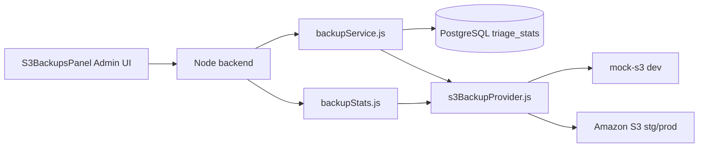

# Amazon S3 database backups

This guide explains how the Suspicious Email Triage project stores **off-site PostgreSQL backups** in **Amazon S3** across **all deployment environments** — development, staging, and production. In development the same code path talks to a **mock S3 container**; in staging and production it uses a real AWS bucket with IAM credentials.

Backups complement Docker named volumes and managed-database snapshots. They give operators a **portable JSON snapshot** of auth metadata and review statistics that can be restored or cloned into another environment even when the original host or volume is lost.

**Audience:** developers new to S3, SOC leads planning disaster recovery, and DevOps engineers wiring staging/production buckets.

**Related:** [ui_guide_s3_backups.md](ui_guide_s3_backups.md) (Admin UI panel), [roadmap_tbd.md](roadmap_tbd.md) §1.5 backups, [stack_guide_staging_production_services.md](stack_guide_staging_production_services.md), [ops_guide_secrets_management.md](ops_guide_secrets_management.md).

---

## Why S3 for backups?

Docker **named volumes** (`postgres-data`, `mongo-data`, …) survive container rebuilds on the same host, but they do not protect against:

- Ransomware or disk corruption on a VM or bare-metal node
- Accidental `docker volume rm` during maintenance
- Need to clone production statistics into a staging cluster for testing
- Cloud region failure when only local volumes exist

**Amazon S3** is durable object storage: upload a file once, AWS replicates it across facilities. Lifecycle rules can move old backups to cheaper storage (Glacier) or delete them after N days.

This project implements a **logical JSON backup** of PostgreSQL tables used for auth and chart statistics — not a full `pg_dump` binary (the API container does not ship PostgreSQL client tools). MongoDB and Neo4j remain on volume or managed-service backups for now; the same S3 pattern can be extended later.

---

## Architecture by environment

| Layer | Development | Staging / production |
|-------|-------------|----------------------|
| **Provider** | `BACKUP_PROVIDER=mock-aws` | `BACKUP_PROVIDER=aws` |
| **Endpoint** | `http://mock-s3:4568` (Docker Compose) | Default AWS S3 HTTPS |
| **Bucket** | `triage-dev-backups` | `triage-staging-backups` / `triage-prod-backups` |
| **Credentials** | Fake keys accepted by mock only | IAM role on ECS/EKS or keys in AWS Secrets Manager |
| **SDK** | `@aws-sdk/client-s3` with custom `endpoint` | Same SDK, real region |


```mermaid
flowchart LR
  UI[S3BackupsPanel Admin UI]
  API[Node backend]
  BS[backupService.js]
  ST[backupStats.js]
  SP[s3BackupProvider.js]
  PG[(PostgreSQL triage_stats)]
  Mock[mock-s3 dev]
  S3[Amazon S3 stg/prod]

  UI --> API
  API --> BS
  API --> ST
  BS --> PG
  BS --> SP
  ST --> SP
  SP --> Mock
  SP --> S3
```

**Pattern:** factory abstraction (`s3BackupProvider.js`) mirrors `secretsProvider.js` — one code path; environment variables select mock vs cloud.

**Technology:** `@aws-sdk/client-s3` with path-style addressing for mock compatibility (same approach as LocalStack-style endpoints).

---

## What gets backed up?

Each backup file is JSON at key `postgres/logical-<timestamp>.json`:

| Section | Contents |
|---------|----------|
| `authUsers` | Email, roles, active flag, theme — **no password hashes** (security) |
| `reviewStatsEvents` | Up to 5,000 most recent rows from `review_stats_events` |
| `summary` | Total event count and user count |

Password hashes stay out of S3 objects so backup files are safer to share with analysts. Full auth restore still uses bootstrap admin flow or Django admin.

---

## REST API

**Permission:** `ops.backups` (included in `admin` role).

| Method | Path | Description |
|--------|------|-------------|
| GET | `/ops/backups/status` | Provider mode, bucket name, endpoint URL |
| GET | `/ops/backups/stats` | Usage snapshot for Admin UI — counts, total size, recent objects |
| GET | `/ops/backups` | List recent object keys under `postgres/` |
| POST | `/ops/backups/run` | Build JSON snapshot and upload to S3 |

Example (replace `<jwt>` — see [auth_guide_obtain_jwt.md](auth_guide_obtain_jwt.md)):

```bash
TOKEN="<jwt-from-admin-login>"

curl -sS http://localhost:3000/ops/backups/stats \
  -H "Authorization: Bearer ${TOKEN}"

curl -sS -X POST http://localhost:3000/ops/backups/run \
  -H "Authorization: Bearer ${TOKEN}"
```

---

## Admin UI

Sign in as admin → **User administration** (`#admin`) → scroll to **S3 database backups**.

The panel calls `GET /ops/backups/stats`, shows provider/bucket/endpoint, summary cards (object count, total size, latest backup time), and a table of recent keys. **Run backup now** triggers `POST /ops/backups/run`.

Full UI walkthrough: [ui_guide_s3_backups.md](ui_guide_s3_backups.md).

---

## Environment variables

Committed in `backend/.env.dev` (non-secret metadata):

```bash
BACKUP_PROVIDER=mock-aws
BACKUP_S3_ENDPOINT=http://mock-s3:4568
BACKUP_S3_BUCKET=triage-dev-backups
```

Staging/prod profiles set `BACKUP_PROVIDER=aws`, real bucket name, and `AWS_REGION`. IAM credentials come from the instance role or secrets bundle — **never commit access keys to Git**.

Set `BACKUP_PROVIDER=disabled` to turn off backup endpoints (returns HTTP 503).

---

## Mock S3 container (development only)

**Service:** `mock-s3` in `infra/docker/docker-compose.yml`  
**Port:** `4568` on localhost  
**Implementation:** `infra/mock-aws-s3/server.js` — in-memory `Map` storage, path-style PUT/GET/List compatible with AWS SDK.

Start with the stack:

```bash
cd ~/suspicious-email-triage
DEPLOYMENT_ENV=dev docker compose -f infra/docker/docker-compose.yml up -d mock-s3 backend
```

---

## Tests

| File | Coverage |
|------|----------|
| `backend/__tests__/backupStats.test.js` | Usage snapshot aggregation |
| `backend/__tests__/opsApi.test.js` | `/ops/backups/*` routes |
| `frontend/src/components/S3BackupsPanel.test.jsx` | Admin UI panel |

<div style="background:#eef1f5;padding:1rem 1.25rem;border-left:4px solid #64748b;margin:1rem 0;border-radius:4px;">

<p><strong>Run in terminal</strong> — backup API tests</p>

```bash
cd ~/suspicious-email-triage/backend
npm test -- --watchAll=false --testPathPattern="backupStats|opsApi"
```

</div>

---

## Security note

Documentation uses placeholders only. Real S3 bucket names in your AWS account and IAM policies are operational details — do not paste gitignored secrets or production access keys into markdown.
