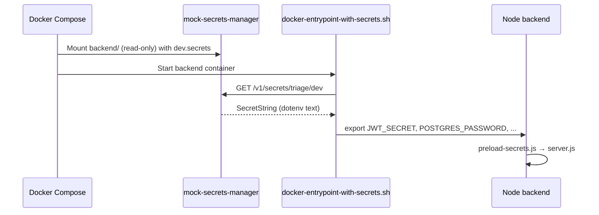

# Secrets management — mock AWS Secrets Manager and rotation

This guide explains **how this project keeps passwords, API keys, and signing keys out of Git**, how containers receive credentials at startup, and **how to rotate secrets safely** without changing application code.

**Audience:** developers new to secrets managers, DevOps engineers preparing staging/production, and security reviewers.

**Related:** [tech_env_configuration.md](tech_env_configuration.md), [stack_guide_build_and_run.md](stack_guide_build_and_run.md), [ops_guide_kubernetes_helm.md](ops_guide_kubernetes_helm.md), [roadmap_tbd.md](roadmap_tbd.md) section 1.1.

---

## Why secrets management matters

When credentials live in Git or plain `.env` files on servers, anyone with repo access (or disk access after a breach) can impersonate users, read databases, or call paid APIs. Enterprise teams store secrets in dedicated systems — **AWS Secrets Manager**, Azure Key Vault, or HashiCorp Vault — and inject them **only at runtime**.

This project implements the **same pattern for free locally**:

| Layer | Technology | Purpose |
|-------|------------|---------|
| Non-sensitive config | `backend/.env.dev`, `.env.staging`, `.env.prod` (committed) | Hostnames, ports, feature flags — safe in Git |
| Real credentials | `backend/dev.secrets`, `staging.secrets`, `prod.secrets` (gitignored) | Passwords, JWT keys, OAuth client secrets |
| Mock AWS API | `mock-secrets-manager` Docker service | Serves `*.secrets` files over HTTP like `GetSecretValue` |
| Abstraction | `backend/src/secrets/secretsProvider.js`, `ai_service/app/secrets_provider.py` | Same code path for mock AWS and future real AWS |
| Container startup | `scripts/docker-entrypoint-with-secrets.sh` | Fetches secrets before Node/Python processes connect to databases |
| CI only | `backend/ci.secrets` (committed **fake** values) | GitHub Actions never touches real staging/prod credentials |

---

## File layout (what goes where)

### Committed — non-sensitive metadata

`backend/.env.dev` (and staging/prod profiles) contain **only** settings that are safe to share in a public repo: service hostnames inside Docker Compose, boolean toggles, index names, public URLs.

They also declare **how** to fetch secrets:

```bash
SECRETS_PROVIDER=mock-aws
SECRETS_MANAGER_URL=http://mock-secrets-manager:4566
SECRETS_BUNDLE_ID=triage/dev
```

### Gitignored — credentials

| File | Used when |
|------|-----------|
| `backend/dev.secrets` | Local Docker (`DEPLOYMENT_ENV=dev`) |
| `backend/staging.secrets` | Staging deploys |
| `backend/prod.secrets` | Production (or replace with real AWS) |

Create dev secrets from the template:

```bash
bash scripts/ensure-dev-secrets.sh
```

Copy `backend/dev.secrets.example` → `backend/dev.secrets` if the script reports the file is missing.

### CI — fake secrets only

`backend/ci.secrets` is **committed** with values like `ci-fake-jwt-secret-not-for-production`. Jest and pytest set `SECRETS_PROVIDER=file` and `SECRETS_FILE=backend/ci.secrets` automatically. **Never put real passwords in this file.**

---

## How startup injection works (Docker)



1. **`mock-secrets-manager`** reads `backend/dev.secrets` from a volume mount and exposes `GET /v1/secrets/triage/dev` (AWS `GetSecretValue`-compatible JSON).
2. **`docker-entrypoint-with-secrets.sh`** runs before every app command. Node sets `SECRETS_PRELOAD=1` and `preload-secrets.js` loads via the abstraction. Python services (`celery`, `manage.py`) shell-export keys from `secrets_provider.py`.
3. Application code reads **`process.env` / `os.environ`** as before — no hard-coded passwords in source files.

---

## Secrets-provider abstraction (Node)

Location: `backend/src/secrets/secretsProvider.js`

| Function | Meaning |
|----------|---------|
| `createSecretsProvider()` | Chooses mock AWS, file, or (future) real AWS based on `SECRETS_PROVIDER` |
| `loadSecretsFromMockAws()` | HTTP client for the mock service |
| `loadSecretsFromFile()` | Direct read of `*.secrets` (fallback for local `npm test`) |
| `applySecretsToProcessEnv()` | Merges keys into `process.env` without printing values |

`backend/src/config/runtime.js` loads the committed `.env.{slice}` profile first, then injects secrets (unless Docker already preloaded them).

---

## Supported secret keys

The bundle can contain **any** environment variable the app expects. Common keys:

| Key | Used by |
|-----|---------|
| `POSTGRES_PASSWORD`, `STATISTICS_PG_URL` | Node stats, Django triage DB, auth |
| `JWT_SECRET` | Login token signing (Node) |
| `DJANGO_SECRET_KEY` | Django session/admin signing |
| `NEO4J_PASSWORD` | Phishing relationship graph |
| `GRAPH_INTERNAL_TOKEN` | Celery → Node internal graph sync |
| `LLM_API_KEY` | Mock or commercial LLM providers |
| `AUTH_BOOTSTRAP_ADMIN_EMAIL`, `AUTH_BOOTSTRAP_ADMIN_PASSWORD` | First admin user |
| `GOOGLE_OAUTH_CLIENT_SECRET`, `GOOGLE_OAUTH_REFRESH_TOKEN` | Google sign-in / Gmail send |
| `SMTP_USER`, `SMTP_PASS` | External SMTP password reset |
| `MONGO_URI` (with credentials) | Staging/prod MongoDB Atlas |

Add new integration keys to `*.secrets.example` templates when you add features — **not** to committed `.env` profiles.

---

## Local developer workflow

After cloning:

```bash
bash scripts/setup-and-build-dev.sh
```

This runs `ensure-dev-secrets.sh`, prompts for bootstrap admin email (written to `dev.secrets`), and builds images.

Start the stack:

```bash
DEPLOYMENT_ENV=dev docker compose -f infra/docker/docker-compose.yml up -d
```

Verify the mock service:

```bash
curl -s http://localhost:4566/health
curl -s http://localhost:4566/v1/secrets/triage/dev | head -c 120
```

You should see JSON with `"Name":"triage/dev"` — **do not paste the full response** (it contains dev credentials).

---

## Rotation procedures (no code changes required)

Rotation means **generate a new secret value**, update the secrets bundle, restart containers. Application code reads env vars — it never embeds the old value.

### JWT signing key (`JWT_SECRET`)

1. Generate a long random string (e.g. 64 hex chars from `openssl rand -hex 32`).
2. Update `backend/dev.secrets` (or staging/prod bundle / AWS console).
3. Restart API containers: `docker compose ... up -d --force-recreate backend django-admin`.
4. **Effect:** all existing login tokens become invalid; users sign in again. Plan rotation during a maintenance window in production.

### PostgreSQL password (`POSTGRES_PASSWORD` / `STATISTICS_PG_URL`)

1. Change password in PostgreSQL (`ALTER USER ...`).
2. Update the matching key in `*.secrets`.
3. Recreate app containers **and** ensure connection strings in `STATISTICS_PG_URL` match.
4. Dev Docker: Postgres password in Compose (`POSTGRES_PASSWORD=triage`) must match `dev.secrets` for local stacks.

### Neo4j password (`NEO4J_PASSWORD`)

1. Update Neo4j auth (Browser `ALTER USER neo4j SET PASSWORD ...` or redeploy with new `NEO4J_AUTH`).
2. Update `NEO4J_PASSWORD` in secrets bundle.
3. Recreate `backend`, `ai-celery`, and `neo4j` as needed.

### OAuth client secret (`GOOGLE_OAUTH_CLIENT_SECRET`)

1. Rotate in Google Cloud Console → Credentials.
2. Re-run `bash scripts/configure-dev-google-oauth.sh ...` (writes to `dev.secrets`).
3. Recreate backend and mock-secrets-manager containers.

### Graph internal token (`GRAPH_INTERNAL_TOKEN`)

1. Generate a new random token; update secrets file.
2. Recreate `backend` and `ai-celery` (Python worker sends this header to Node internal graph routes).

---

## CI/CD policy

GitHub Actions (`.github/workflows/ci.yml`) runs tests with **`backend/ci.secrets` only**. It does **not** mount `dev.secrets` or use GitHub Actions encrypted secrets for real databases.

To add staging integration tests later, use **ephemeral test credentials** created in the workflow job — never production bundles.

---

## Replacing mock AWS with real AWS Secrets Manager

1. Create secret `triage/prod` in AWS with the same keys as `prod.secrets.example`.
2. Set in `backend/.env.prod`:
   ```bash
   SECRETS_PROVIDER=aws
   SECRETS_MANAGER_URL=https://secretsmanager.us-east-1.amazonaws.com
   SECRETS_BUNDLE_ID=triage/prod
   ```
3. Extend `loadSecretsFromMockAws()` (or add `loadSecretsFromAws()`) to use AWS SDK SigV4 — the HTTP shape is already documented in the mock service.
4. Remove volume mount of `backend/` into mock service in production; use IAM roles for tasks (ECS/EKS) instead.

Helm deployments can continue using Kubernetes Secrets populated from External Secrets Operator — see [ops_guide_kubernetes_helm.md](ops_guide_kubernetes_helm.md).

---

## Troubleshooting

| Symptom | Likely cause | Fix |
|---------|--------------|-----|
| API exits on startup with secrets error | `dev.secrets` missing | `bash scripts/ensure-dev-secrets.sh` |
| Login fails after clone | Bootstrap email not in secrets | `bash scripts/configure-dev-bootstrap-admin.sh you@example.com` |
| Mock service 404 | Wrong secret id or file name | File must be `backend/dev.secrets` for `triage/dev` |
| Tests pass locally but Docker fails | Stale container env | `--force-recreate backend mock-secrets-manager` |

---

## Security reminders

- **Never commit** `dev.secrets`, `staging.secrets`, or `prod.secrets`.
- **Never copy** secret values into Markdown docs, chat, or screenshots.
- Documentation references **variable names** only — read values on your machine from the gitignored files.
