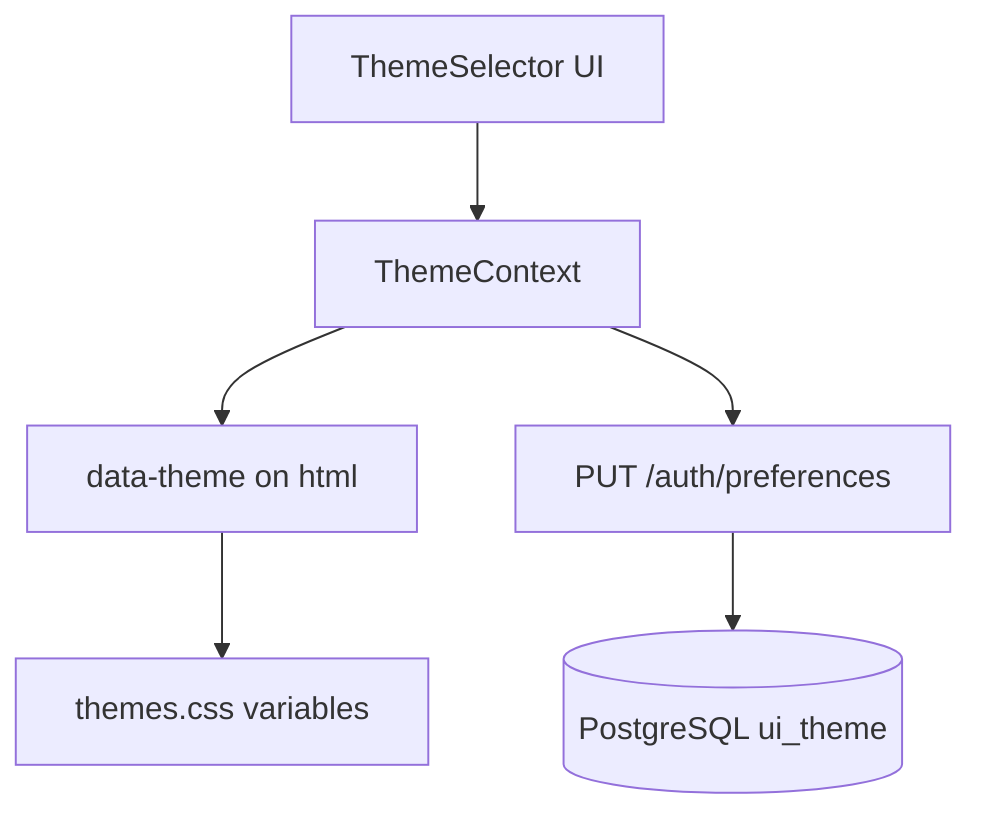

# UI themes guide

The React analyst UI supports **17 built-in color themes** per user, persisted in PostgreSQL and applied instantly via **CSS custom properties** (variables) and a `data-theme` attribute on the document root. No page reload is required when switching themes.

**Related:** [auth_guide_rbac.md](auth_guide_rbac.md), `frontend/src/styles/themes.css`, `backend/src/auth/themeConstants.js`.

---

## How theming works (novice overview)

1. **CSS variables** — Each theme defines tokens like `--bg`, `--text`, `--accent` on `[data-theme="theme-id"]` selectors.
2. **DOM attribute** — JavaScript sets `document.documentElement.setAttribute("data-theme", "ocean-dark")`.
3. **Components** — Layout and components use `var(--bg)`, `var(--accent)`, etc., so one attribute swap recolors the whole app.
4. **Persistence** — Logged-in users store choice in `auth_users.ui_theme`; guests use `localStorage` until login.



---

## CSS variables and `data-theme`

**File:** `frontend/src/styles/themes.css`

Pattern (documented at top of file):

```css
[data-theme="default-light"] {
  --bg: #f6f7f9;
  --surface: #ffffff;
  --text: #1b1f24;
  --accent: #1f5eff;
  /* ... */
}
```

Shared semantic tokens across themes:

| Variable | Typical use |
|----------|-------------|
| `--bg` | Page background |
| `--surface` | Cards, panels |
| `--border` | Dividers |
| `--text` / `--muted` | Primary and secondary text |
| `--accent` / `--accent-soft` | Buttons, links, highlights |
| `--danger` / `--warn` / `--ok` | Status colors |
| `--radius` / `--shadow` | Layout polish |

`:root` and `default-light` share the same block so first paint has sensible defaults before React hydrates.

**Helper:** `frontend/src/themes/themes.js` — `applyThemeToDocument(themeId)` sets `data-theme` on `<html>`.

---

## The 17 themes

Ids are identical in the backend catalog, frontend `THEMES` array, and CSS blocks. Invalid ids fall back to **`default-light`**.

| id | Label | Category |
|----|-------|----------|
| `default-light` | Default light | light |
| `default-dark` | Default dark | dark |
| `ocean-light` | Ocean light | light |
| `ocean-dark` | Ocean dark | dark |
| `forest-light` | Forest light | light |
| `forest-dark` | Forest dark | dark |
| `sunset` | Sunset | colorful |
| `midnight` | Midnight | dark |
| `high-contrast-light` | High contrast light | bw |
| `high-contrast-dark` | High contrast dark | bw |
| `monochrome` | Monochrome | bw |
| `lavender` | Lavender | colorful |
| `coral` | Coral | colorful |
| `solarized-light` | Solarized light | light |
| `solarized-dark` | Solarized dark | dark |
| `nord` | Nord | dark |
| `dracula` | Dracula | dark |

**Source of truth for API validation:** `backend/src/auth/themeConstants.js` (`UI_THEMES`, `isValidUiTheme()`).

Adding a theme requires updating **three** places: `themeConstants.js`, `themes.css` (`[data-theme="new-id"]`), and `frontend/src/themes/themes.js` (`THEMES`).

---

## PostgreSQL: `auth_users.ui_theme`

**Module:** `backend/src/auth/authPg.js`

On schema init/migrate:

- Column `ui_theme TEXT NOT NULL DEFAULT 'default-light'` on `auth_users`.

Functions:

- `getUserUiTheme(userId)` — read current theme.
- `setUserUiTheme(userId, themeId)` — update after validation.

Theme is also returned on **`GET /auth/me`** as `user.uiTheme` for immediate SPA hydration after login.

---

## API: `GET` and `PUT /auth/preferences`

**File:** `backend/src/api/auth.js`  
**Auth:** JWT required (`authenticate` middleware).

### `GET /auth/preferences`

Returns catalog + current selection:

```json
{
  "uiTheme": "ocean-dark",
  "themes": [
    { "id": "default-light", "label": "Default light", "category": "light" }
  ],
  "defaultTheme": "default-light"
}
```

### `PUT /auth/preferences`

Body:

```json
{ "uiTheme": "dracula" }
```

Success: `{ "ok": true, "uiTheme": "dracula" }`  
Invalid id: `400` with `{ "error": "invalid_ui_theme", "allowed": [ "..."] }`

Example (replace token with yours from login — use dev admin credentials from project docs, not real production passwords):

```bash
TOKEN="<jwt>"

curl -sS http://localhost:3000/auth/preferences \
  -H "Authorization: Bearer ${TOKEN}"

curl -sS -X PUT http://localhost:3000/auth/preferences \
  -H "Authorization: Bearer ${TOKEN}" \
  -H "Content-Type: application/json" \
  -d '{"uiTheme":"nord"}'
```

---

## Frontend: `ThemeContext`

**Files:**

- `frontend/src/context/ThemeContext.jsx` — state, API sync, persistence
- `frontend/src/components/ThemeSelector.jsx` — picker UI (`useTheme()`)
- `frontend/src/App.js` — wraps app with `<ThemeProvider>`

Behavior:

| User state | Persistence |
|------------|-------------|
| Guest (not logged in) | `localStorage` key `triage_ui_theme_guest` |
| Authenticated | `PUT /auth/preferences` after each change; loads catalog via `GET /auth/preferences` |
| Login | Prefers `user.uiTheme` from `/auth/me` over guest localStorage |

`useTheme()` exposes:

- `themeId` — current id
- `themes` — catalog (from API when logged in, else bundled list)
- `setThemeId(id)` — updates DOM immediately, then persists
- `loading` — true while PUT is in flight

Theme changes apply **before** the server responds so the UI stays snappy; failed PUT can be retried from the selector.

---

## Tests

- `backend/__tests__/authPreferences.test.js` — GET catalog, PUT validation, persistence
- `frontend/src/themes/themes.test.js` — `applyThemeToDocument` sets `data-theme`

---

## Design notes

- Themes are **cosmetic** — they do not affect RBAC, verdicts, or API permissions.
- High-contrast and monochrome themes support accessibility preferences; verify contrast in your deployment if compliance requires WCAG audit.
- Keep theme ids **stable** once users have saved preferences; renaming an id requires a DB migration mapping old → new values.
