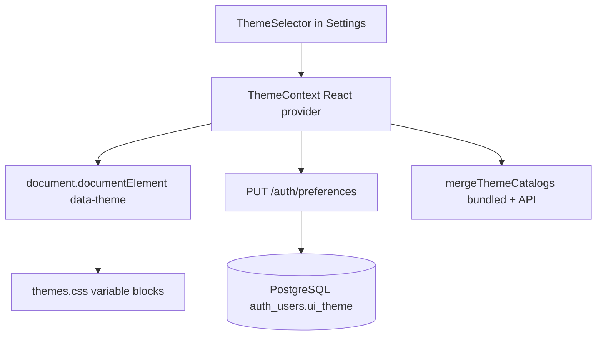

# UI themes guide

The React analyst UI supports **18 built-in color themes** per user. A theme is not just a pretty palette — it is a named set of **CSS custom properties** (variables) such as `--bg`, `--text`, and `--accent` that every panel, button, and chart inherits. When you pick a theme, the browser applies new colors **instantly** without reloading the page.

Themes are persisted per authenticated user in **PostgreSQL** (`auth_users.ui_theme`). Guests who have not signed in yet store their choice in **localStorage** until they log in.

**Related guides:** [auth_guide_rbac.md](auth_guide_rbac.md) (who can sign in), [ui_guide_app_navigation.md](ui_guide_app_navigation.md) (where the theme picker lives — **Settings** tab, not the header).

---

## How theming works (for developers new to CSS variables)

Modern CSS lets you define reusable tokens on a selector. Our themes attach those tokens to the HTML root element using a **`data-theme`** attribute:

```html
<html data-theme="spring-blossom">
```

Each theme block in `frontend/src/styles/themes.css` looks like this:

```css
[data-theme="spring-blossom"] {
  --bg: #e8f4fc;
  --surface: #fffef5;
  --text: #1b2838;
  --accent: #e87830;
  /* ... danger, warn, ok, radius, shadow ... */
```

Every component uses `var(--bg)`, `var(--accent)`, and so on. Changing **one attribute** on `<html>` recolors the entire single-page application (SPA). This pattern is sometimes called **design tokens via CSS variables** — it avoids duplicating hex codes in JavaScript and keeps theming purely declarative in CSS.

**Technology stack involved:**

| Layer | File / tool | Role |
|-------|-------------|------|
| Token definitions | `frontend/src/styles/themes.css` | One `[data-theme="…"]` block per theme id |
| Catalog & helpers | `frontend/src/themes/themes.js` | Lists themes, validates ids, applies `data-theme` |
| React state | `frontend/src/context/ThemeContext.jsx` | Loads/saves preference, merges API + bundled catalog |
| Picker UI | `frontend/src/components/ThemeSelector.jsx` | Grouped `<select>` in Settings |
| Server validation | `backend/src/auth/themeConstants.js` | Same ids as frontend; rejects unknown ids on PUT |
| Persistence | `backend/src/auth/authPg.js` | Reads/writes `auth_users.ui_theme` |



---

## The spring-blossom theme (and why it might have seemed missing)

The theme id is **`spring-blossom`** (not “sprint-blossom” — that is a common typo). Its label in the picker is **Spring blossom (light blue & green)** so it is easy to distinguish from **Forest light** (`forest-light`), which is a different green palette.

**Visual character:** light-blue page background, warm yellow-tinted card surfaces, orange accent buttons, fresh green success states, burgundy errors, purple warnings.

When you are signed in, `ThemeContext` fetches the theme list from **`GET /auth/preferences`**. In older deployments the API container might return a catalog that **predates** `spring-blossom` (for example if the backend Docker image was not rebuilt after the theme was added). Previously the SPA **replaced** its bundled list entirely with the API response, which could hide new frontend themes.

**Fix (implemented):** `mergeThemeCatalogs()` in `themes.js` always starts from the **bundled** `THEMES` array shipped with the frontend build, then overlays any matching entries from the server. New SPA themes therefore appear in Settings even before the API image catches up. Server labels still win when both sides define the same id.

**Where to pick it:** open the **Settings** sub-window (`#settings` in the URL hash) → **Theme** dropdown → **colorful** group → **Spring blossom (light blue & green)**.

---

## All 18 themes

Ids must match across **three** places when adding a theme: `backend/src/auth/themeConstants.js`, `frontend/src/themes/themes.js`, and a new `[data-theme="…"]` block in `themes.css`. Invalid ids fall back to **`default-light`**.

| id | Label | Category |
|----|-------|----------|
| `default-light` | Default light | light |
| `default-dark` | Default dark | dark |
| `ocean-light` | Ocean light | light |
| `ocean-dark` | Ocean dark | dark |
| `forest-light` | Forest light | light |
| `forest-dark` | Forest dark | dark |
| `sunset` | Sunset | colorful |
| `midnight` | Midnight | dark |
| `high-contrast-light` | High contrast light | bw |
| `high-contrast-dark` | High contrast dark | bw |
| `monochrome` | Monochrome | bw |
| `lavender` | Lavender | colorful |
| `coral` | Coral | colorful |
| `solarized-light` | Solarized light | light |
| `solarized-dark` | Solarized dark | dark |
| `nord` | Nord | dark |
| `dracula` | Dracula | dark |
| `spring-blossom` | Spring blossom (light blue & green) | colorful |

---

## PostgreSQL column: `auth_users.ui_theme`

**Module:** `backend/src/auth/authPg.js`

When the auth schema is created or migrated, each user row gets:

```sql
ui_theme TEXT NOT NULL DEFAULT 'default-light'
```

Helper functions:

- `getUserUiTheme(userId)` — read stored preference.
- `setUserUiTheme(userId, themeId)` — validate against `themeConstants.js`, then UPDATE.

The current theme is also returned on **`GET /auth/me`** as `user.uiTheme` so the SPA can paint the correct colors immediately after login without waiting for a second request.

---

## REST API: `GET` and `PUT /auth/preferences`

**Router:** `backend/src/api/auth.js`  
**Middleware:** JWT bearer authentication (`authenticate`).

### `GET /auth/preferences`

Returns the full catalog plus the user’s current selection:

```json
{
  "uiTheme": "ocean-dark",
  "themes": [
    { "id": "default-light", "label": "Default light", "category": "light" },
    { "id": "spring-blossom", "label": "Spring blossom (light blue & green)", "category": "colorful" }
  ],
  "defaultTheme": "default-light"
}
```

### `PUT /auth/preferences`

Request body:

```json
{ "uiTheme": "spring-blossom" }
```

Success: `{ "ok": true, "uiTheme": "spring-blossom" }`  
Unknown id: HTTP `400` with `{ "error": "invalid_ui_theme", "allowed": [ "..."] }`

Example curl (replace `<jwt>` with a token from login — see [auth_guide_obtain_jwt.md](auth_guide_obtain_jwt.md); never paste real production passwords into docs):

```bash
TOKEN="<jwt-from-login>"

curl -sS http://localhost:3000/auth/preferences \
  -H "Authorization: Bearer ${TOKEN}"

curl -sS -X PUT http://localhost:3000/auth/preferences \
  -H "Authorization: Bearer ${TOKEN}" \
  -H "Content-Type: application/json" \
  -d '{"uiTheme":"spring-blossom"}'
```

---

## Frontend: `ThemeContext` and `ThemeSelector`

**Files:**

- `frontend/src/context/ThemeContext.jsx` — React Context provider; syncs DOM, API, localStorage
- `frontend/src/components/ThemeSelector.jsx` — grouped `<select>` using `useTheme()`
- `frontend/src/App.js` — wraps the tree with `<ThemeProvider>`

**Behavior by user state:**

| User state | Where preference is stored |
|------------|----------------------------|
| Guest (login screen) | `localStorage` key `triage_ui_theme_guest` |
| Authenticated | PostgreSQL via `PUT /auth/preferences` after each change |
| Just logged in | Prefers `user.uiTheme` from `/auth/me` over guest localStorage |

**Optimistic UI:** `setThemeId()` updates `data-theme` on `<html>` **before** the PUT completes so the interface feels instant. If the network call fails, colors stay changed locally; the user can pick the theme again to retry.

**Catalog merge:** after login, `mergeThemeCatalogs(apiThemes, THEMES)` ensures all bundled themes (including `spring-blossom`) appear in the Settings dropdown.

`useTheme()` returns:

- `themeId` — current theme id string
- `themes` — array of `{ id, label, category }`
- `setThemeId(id)` — change theme
- `loading` — true while PUT is in flight

---

## Tests

| Test file | What it verifies |
|-----------|------------------|
| `backend/__tests__/authPreferences.test.js` | GET catalog includes `spring-blossom`; PUT validation |
| `frontend/src/themes/themes.test.js` | `isValidTheme`, `applyThemeToDocument`, `mergeThemeCatalogs` |
| `integration_tests/test_repo_guardrails.py` | Repo guardrail: spring-blossom present in theme constants |

<div style="background:#eef1f5;padding:1rem 1.25rem;border-left:4px solid #64748b;margin:1rem 0;border-radius:4px;">

<p><strong>Run in terminal</strong> — backend preferences API</p>

```bash
cd ~/suspicious-email-triage/backend
npm test -- --watchAll=false --testPathPattern=authPreferences
```

</div>

<div style="background:#eef1f5;padding:1rem 1.25rem;border-left:4px solid #64748b;margin:1rem 0;border-radius:4px;">

<p><strong>Run in terminal</strong> — frontend theme utilities</p>

```bash
cd ~/suspicious-email-triage/frontend
npm test -- --watchAll=false --testPathPattern=themes.test
```

</div>

---

## Design and accessibility notes

- Themes affect **appearance only** — they do not change RBAC, API permissions, or verdict logic.
- High-contrast and monochrome themes exist for operators who prefer stronger contrast or grayscale UI; run your own WCAG audit if compliance requires it.
- **Stable ids:** once users save a theme, renaming an id requires a database migration mapping old → new values.
- **Documentation security:** this guide uses placeholders only. Real JWT secrets, database passwords, and OAuth client secrets live in gitignored `*.secrets` files — never copy them into markdown.
